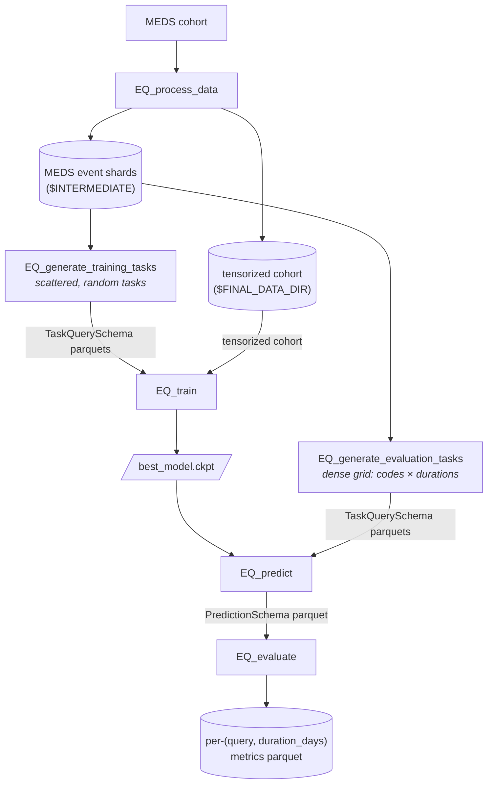

# EveryQuery

[](https://github.com/payalchandak/EveryQuery/actions/workflows/tests.yaml)
[](https://codecov.io/gh/payalchandak/EveryQuery)
[](https://www.python.org)
[](https://lightning.ai)
[](https://hydra.cc)
[](LICENSE)

A framework for training and evaluating foundation models over structured EHR data, built on
the [MEDS](https://github.com/Medical-Event-Data-Standard) ecosystem —
[`meds-torch-data`](https://github.com/mmcdermott/meds-torch-data) for tensorization,
[`MEDS-transforms`](https://github.com/mmcdermott/MEDS_transforms) for preprocessing, PyTorch
Lightning for training.

Given a tensorized MEDS cohort, EveryQuery trains a ModernBERT-style encoder to answer
"query" prediction tasks of the form: *given a subject's history up to time `t`, will code
`c` occur within `d` days?* The same trained model is then evaluated against arbitrary
`(code, duration)` combinations.

> [!NOTE]
> The Phase-1 + Phase-2 refactor from [#54](https://github.com/payalchandak/EveryQuery/issues/54) has landed: the full `preprocess → generate_training_tasks / generate_evaluation_tasks → train → predict → evaluate` pipeline uses the cross-stage [`TaskQuerySchema`](src/every_query/data/schema.py) throughout. `EQ_evaluate` now resolves to the single-stage evaluator that consumes `PredictionSchema` parquets; the legacy four-stage evaluator has been deleted (recover from git history if needed). See [Roadmap](#roadmap) for the remaining #83 cleanup.

## Install

**For development** (recommended):

```bash
git clone git@github.com:payalchandak/EveryQuery.git
cd EveryQuery
uv sync --group dev
cp .env.example .env # then edit paths for your machine
```

**As a dependency:**

```bash
# not yet on PyPI — installable from git for now:
pip install "git+https://github.com/payalchandak/EveryQuery.git@main"
```

## Repository layout

Every production module lives under a submodule that reflects its role:

```
src/every_query/
├── preprocessing/      → EQ_process_data        (raw MEDS → tensorized cohort)
├── generate_tasks/     → EQ_generate_training_tasks + EQ_generate_evaluation_tasks (TaskQuerySchema parquets: scattered for PT, dense for eval)
├── train/              → EQ_train               (train the model)
├── predict/            → EQ_predict             (inference; consumes TaskQuerySchema, emits PredictionSchema)
│   └── external_tasks/                         (ACES + composite aggregation — currently `python -m` only;
│                                                  [#62](https://github.com/payalchandak/EveryQuery/issues/62) tracks promoting to console scripts, draft PR [#95](https://github.com/payalchandak/EveryQuery/pull/95))
├── evaluate/           → EQ_evaluate           (metrics on a PredictionSchema parquet)
├── model/              (shared: nn.Module + LightningModule)
├── data/               (shared: PyTorch Dataset + Batch types + TaskQuerySchema)
└── utils/              (helpers: seeds, code slugs, env-var validation, model_loader)
```

Every submodule has its own `README.md` explaining what belongs there, its pipeline
position, and the tracking issues for remaining work.

Research-only, paper-specific code (ID/OOD code sampling, ablations, the results notebook,
figure code) lives in the top-level [`experiments/`](experiments/) directory, **outside** the
shipped `every_query` package. It is a staging area for the planned `EveryQueryExperiments`
repo split tracked in [#186](https://github.com/payalchandak/EveryQuery/issues/186).

## Console scripts

`pip install` exposes the CLIs below, all Hydra-configurable. Run any with `--help` or
`--cfg job` to inspect the resolved config. The **Tests** column summarises the coverage
that lands with each CLI on `dev` today — unit tests (fast, `tests/test_<name>_logic.py`
or `tests/test_<module>.py`), CLI smoke tests (`tests/test_cli_smoke.py`, `--help`-exits-0),
and end-to-end subprocess tests that run the real script against a fixture cohort.

| Script                         | Stage            | Purpose                                                                                                                 | Tests                                                                                                                    |
| ------------------------------ | ---------------- | ----------------------------------------------------------------------------------------------------------------------- | ------------------------------------------------------------------------------------------------------------------------ |
| `EQ_process_data`              | preprocessing    | Orchestrate MEDS-transforms + `meds-torch-data` tensorization                                                           | smoke; E2E via `test_process_data.py` + `test_e2e_foundation.py`                                                         |
| `EQ_generate_training_tasks`   | PT task labels   | Sample `N` tasks × `M` contexts (scattered `(query, duration_days)`), label via single-pass asof                        | smoke; unit `test_sample_tasks.py`; E2E `test_generate_tasks.py`                                                         |
| `EQ_generate_evaluation_tasks` | eval task labels | Sample `K` prediction times per subject, cross-join with `(codes × durations)` grid for dense evaluation shape          | smoke; E2E `test_generate_evaluation_tasks_cli.py`                                                                       |
| `EQ_train`                     | training         | Train the ModernBERT encoder on the labeled tasks                                                                       | smoke; unit `test_training.py`; E2E `test_train_cli.py` + `test_train.py`; signal test `tests/training_validity/` (slow) |
| `EQ_predict`                   | inference        | Consume a `TaskQuerySchema` parquet dir + checkpoint, emit a `PredictionSchema` parquet (`censor_prob`, `occurs_prob`)  | smoke; E2E `test_predict_cli.py` (row-order preserved); exercised by `tests/training_validity/` (slow)                   |
| `EQ_evaluate`                  | metrics          | Consume a `PredictionSchema` parquet, write per-`(query, duration_days)` metrics (`occurs_auroc`, `censor_auroc`, etc.) | smoke; E2E `test_evaluate_cli.py`; exercised by `tests/training_validity/` (slow)                                        |

The legacy four-stage evaluator (`every_query.evaluate.eval`, with `gen_index_times`, `gen_task`, `select_model` siblings) has been deleted; recover from git history if needed. [#83](https://github.com/payalchandak/EveryQuery/issues/83) tracks any `experiments/leaderboard/` relocation for cross-model comparison.

## Pipeline

### Current (on `dev`)



Both task-generation endpoints emit `TaskQuerySchema`-conformant parquets. Training uses the scattered shape (one random `(query, duration_days)` per row); evaluation uses the dense shape (every held-out `(subject, time)` × every `(query × duration)` the user wants metrics for) so `EQ_predict` + `EQ_evaluate` cover a full grid without having to run inference twice.

### 1. Preprocess

```bash
EQ_process_data \
	input_dir="$RAW" \
	intermediate_dir="$INTERMEDIATE" \
	output_dir="$FINAL_DATA_DIR"
```

Produces a tensorized MEDS cohort under `$FINAL_DATA_DIR`. `$INTERMEDIATE` is a staging
directory for the MEDS-transforms stages; `$PROCESSED` holds cross-shard metadata
(`$PROCESSED/metadata/codes.parquet` is the query-code universe the sampler draws from).

### 2a. Generate pre-training task labels

```bash
EQ_generate_training_tasks \
	split=train \
	num_queries=4000000 \
	num_contexts_per_query=1 \
	max_workers=1 \
	data_dir="$INTERMEDIATE" \
	out_dir="$TRAINING_TASKS_DIR"
```

`data_dir` is the MEDS dataset root (event shards read from `{data_dir}/data/{split}/*.parquet`) and `out_dir` is the final-dataset root. Both are optional CLI overrides — omit them to fall back to `$INTERMEDIATE` and `$TRAINING_TASKS_DIR` from your `.env`.

One command runs the whole 5-stage sampler in a single process (Stages 0–3 inline, then Stage 4 labels shards in parallel). The dataset lands at `$TRAINING_TASKS_DIR/{split}/{shard}.parquet`, with intermediates in the sibling `*_artifacts` dir (see [`generate_tasks/README.md`](src/every_query/generate_tasks/README.md)). Columns conform to [`TaskQuerySchema`](src/every_query/data/schema.py) — `subject_id, prediction_time, query, duration_days, boolean_value` — where `boolean_value` is three-valued: `True` (query code occurs in `(prediction_time, prediction_time + duration_days]`), `False` (window fully observed, no occurrence), or `null` (censored — window extends past the subject's last recorded time).

> `max_workers` sets how many shards are labeled in parallel, so raising it raises peak RAM. If Stage 4 OOMs, set `max_workers=1`.

> **Note:** The total number of training samples generated will be `num_queries * num_contexts_per_query`

`query_codes=` is optional for training. Leave it unset/null to sample query codes from
`$PROCESSED/metadata/codes.parquet`, or set it to an inline list / YAML path to restrict which
codes can be sampled as queries. YAML files may be a flat list or a mapping with a `codes:`
key. This does not remove codes from patient histories.

```bash
EQ_generate_training_tasks query_codes=/path/to/train_query_codes.yaml …
```

```yaml
# train_query_codes.yaml
codes:
  - HR
  - TEMP
```

### 2b. Generate evaluation task labels

```bash
EQ_generate_evaluation_tasks \
	split=held_out \
	input_shard=0 \
	prediction_times_per_subject=5 \
	'codes=[HR, TEMP]' \
	'durations=[1, 7, 30, 90, 365]' \
	data_dir="$INTERMEDIATE" \
	codes_dir=/path/to/processed \
	out_dir=$TASK_DIR
```

Samples `1` prediction times per subject by default, cross-joins with the full `(codes × durations)` grid, labels via the same primitive as training. Output lands under `$TASK_DIR/eval/{split}/*.parquet` (separate `eval/` subdir so it doesn't collide with the training-task output).

The endpoint writes one parquet per `(split, input_shard)` worker, so to label a whole split use Hydra multirun (`-m`) to sweep `input_shard` — there's no auto-discovery, so enumerate the range explicitly. Count the shards for your split first (`N` = this number):

```bash
ls "$INTERMEDIATE"/data/held_out/*.parquet | wc -l
```

Then sweep `input_shard=range(0,N)`:

```bash
# Sequential (basic launcher) — one shard after another in a single process:
EQ_generate_evaluation_tasks -m \
	input_shard=range(0,16) \
	split=held_out \
	prediction_times_per_subject=5 \
	'codes=[HR, TEMP]' \
	'durations=[1, 7, 30, 90, 365]'

# Parallel on SLURM (submitit launcher — already a dependency):
EQ_generate_evaluation_tasks -m \
	hydra/launcher=submitit_slurm \
	input_shard=range(0,16) \
	split=held_out …
```

A comma list (`input_shard=0,1,2`) works too; `range(0,16)` is just shorthand for `0..15`. The prediction-time sampler is deterministic in `(seed, input_shard, split)`, so a swept run and the equivalent per-shard runs produce identical output.

As with training, `data_dir` / `codes_dir` / `out_dir` are optional CLI overrides — omit them to fall back to `$INTERMEDIATE`, `$PROCESSED`, and `$TASK_DIR` from your `.env`. `codes_dir` (the `{codes_dir}/metadata/codes.parquet` query universe) is ignored when `codes=` is passed explicitly.

`codes=` accepts an inline list (as above), a metadata root / `codes.parquet` path, or — for reproducible pre-sampled code universes kept out of git — a path to a YAML file. The YAML is either a bare list or a mapping with a `codes:` key:

```yaml
# sampled_codes.yaml
codes:
  - HR
  - TEMP
  - ICD//A01
```

```bash
EQ_generate_evaluation_tasks codes=/path/to/sampled_codes.yaml …
```

### 3. Train

```bash
EQ_train \
	output_dir="$OUTPUT_DIR/outputs/\${run_id:}" \
	datamodule.config.task_labels_dir="$TRAINING_TASKS_DIR" \
	datamodule.config.tensorized_cohort_dir="$FINAL_DATA_DIR"
```

`datamodule.config.task_labels_dir` defaults to `${oc.env:TASK_DIR}`, so point it at `$TRAINING_TASKS_DIR` (where `EQ_generate_training_tasks` now writes) — or export `$TASK_DIR` to that location. `EQ_train` reads the long-format labels written by `EQ_generate_training_tasks` directly — the inline collation step that lived in `train.py` was removed in [#76](https://github.com/payalchandak/EveryQuery/pull/76).

Seeding: `cfg.seed` (default `140799`) is passed through `lightning.seed_everything` *before* model + datamodule instantiation (fix landed in [#124](https://github.com/payalchandak/EveryQuery/pull/124)), so model weight initialization is byte-reproducible across Python versions and platforms for a given seed.

### 4. Predict

```bash
EQ_predict \
	model_run_dir="$OUTPUT_DIR/outputs/YYYY-MM-DD/HH-MM-SS" \
	tasks_dir="$TASK_DIR/eval/held_out" \
	output_parquet="$OUTPUT_DIR/predictions.parquet" \
	split=held_out
```

Reads every `*.parquet` under `tasks_dir` (`TaskQuerySchema`-conformant), runs the checkpoint's `predict_step` over the chosen split, writes a single `PredictionSchema` parquet with `censor_prob` + `occurs_prob` per input row. See [`predict/README.md`](src/every_query/predict/README.md) for details.

### 5. Evaluate

```bash
EQ_evaluate \
	predictions_parquet="$OUTPUT_DIR/predictions.parquet" \
	metrics_parquet="$OUTPUT_DIR/metrics.parquet"
```

Per-`(query, duration_days)` metrics from the predictions parquet — `n_rows`, `n_occurs_labeled`, `n_positive`, `prevalence`, `occurs_auroc` (on non-censored rows), `censor_auroc`. See [`evaluate/README.md`](src/every_query/evaluate/README.md).

## Configuration

All CLIs are `@hydra.main` entry points; every config knob is overridable on the command
line with `key=value` or `+new_key=value`. The config directory is resolved via
`importlib.resources.files("every_query")`, so package-shipped YAMLs work identically
whether you run from a source checkout or a `pip install`ed wheel.

### Environment variables

`ensure_env()` (in `utils/_env.py`) requires these be set before `EQ_train` and the eval
CLIs. Scope of this gate was tightened in [#127](https://github.com/payalchandak/EveryQuery/pull/127)
— `PROCESSED` and `INTERMEDIATE` were dropped because no Hydra config interpolates them
(they were only read by a dotenv fallback in the sampler, which already tolerates missing
env vars when CLI config values are supplied).

| Var                  | Purpose                                                                                                                                  |
| -------------------- | ---------------------------------------------------------------------------------------------------------------------------------------- |
| `PROJECT_DIR`        | Repo root (for relative output paths in a few configs)                                                                                   |
| `OUTPUT_DIR`         | Where training run dirs land                                                                                                             |
| `TRAINING_TASKS_DIR` | Final training-task dataset (output of `EQ_generate_training_tasks`); intermediates go to the sibling `*_artifacts` dir                  |
| `TASK_DIR`           | Evaluation-task parquets (`EQ_generate_evaluation_tasks` writes `$TASK_DIR/eval/...`); also the default `task_labels_dir` for `EQ_train` |
| `FINAL_DATA_DIR`     | Tensorized cohort (output of `EQ_process_data`)                                                                                          |
| `WANDB_ENTITY`       | W&B entity for training telemetry                                                                                                        |

`.env.example` is the reference — copy to `.env` and edit. Python loads it via
`python-dotenv`. Further phases of
[#117](https://github.com/payalchandak/EveryQuery/issues/117) will migrate the remaining
gated vars to `${oc.env:VAR,???}` / `${oc.env:VAR,default}` form (Hydra-native required
or optional-with-fallback) and eventually retire `ensure_env()` entirely.

## Development

```bash
uv sync --group dev
uv run pytest                         # full suite, excluding slow tests (~2 min)
uv run pytest -m 'slow or not slow'   # full suite incl. slow training-validity test (~8-10 min extra)
uv run pytest tests/test_cli_smoke.py # CLI smoke tests only
uv run pre-commit run --all-files     # lint, format, codespell
```

CI runs the full `pytest -m "slow or not slow"` (both `slow`-marked and unmarked tests)
on Python 3.11 and 3.12, plus `ruff check` and `ruff format --check` on every PR; coverage
is uploaded to Codecov. Full CI session: ~10-11 min typical.

### Test layout

```
tests/
├── test_cli_smoke.py               (every EQ_* CLI; --help exits 0)
├── test_process_data.py            (E2E: EQ_process_data output shape + metadata)
├── test_generate_tasks.py          (E2E: EQ_generate_training_tasks ground-truth label recompute + reproducibility)
├── test_generate_evaluation_tasks_cli.py  (E2E: EQ_generate_evaluation_tasks dense-grid shape + determinism)
├── test_sample_tasks.py            (unit: sampler primitives, determinism, edge cases)
├── test_train_cli.py               (E2E: EQ_train CLI, resume flow, overwrite flag)
├── test_train.py                   (E2E: resume-actually-loads-ckpt two-stage differential)
├── test_training.py                (unit: single training step, checkpoint roundtrip, demo-mode checks)
├── test_predict_cli.py             (E2E: EQ_predict against a trained checkpoint + row-order preservation)
├── test_evaluate_cli.py            (E2E: EQ_evaluate on a synthetic PredictionSchema parquet)
├── test_e2e_foundation.py          (E2E: full preprocess → generate_training_tasks → train pipeline chains)
├── test_dataset_logic.py           (unit: EveryQueryPytorchDataset + EveryQueryBatch)
├── test_lightning_logic.py         (unit: LightningModule loss wiring, mask semantics)
├── test_model_logic.py             (unit: model heads, censored/occurs loss flip sensitivity)
├── test_run_id.py                  (unit: run_id resolver determinism)
└── training_validity/              (E2E @pytest.mark.slow: model actually learns; runs the full EQ_predict → EQ_evaluate chain; see its README)
    ├── __init__.py
    ├── conftest.py
    ├── README.md
    └── test_training_validity.py
```

## Roadmap

Overall refactor umbrella: [#54](https://github.com/payalchandak/EveryQuery/issues/54) —
target architecture is `preprocess → generate_tasks → train → predict → evaluate` with a
shared cross-stage task-query schema.

### Phase 2 status

| Sub-phase                         | Issue                                                       | State                                                                                                                                                           |
| --------------------------------- | ----------------------------------------------------------- | --------------------------------------------------------------------------------------------------------------------------------------------------------------- |
| 2.1: TaskQuerySchema design       | [#80](https://github.com/payalchandak/EveryQuery/issues/80) | ✅ merged via [#96](https://github.com/payalchandak/EveryQuery/pull/96) (also closes #122)                                                                      |
| 2.2: EQ_predict                   | [#81](https://github.com/payalchandak/EveryQuery/issues/81) | ✅ merged via [#99](https://github.com/payalchandak/EveryQuery/pull/99)                                                                                         |
| 2.3: eval-suite inventory         | [#82](https://github.com/payalchandak/EveryQuery/issues/82) | Decisions captured on the issue + reflected in #100's scope; no code change needed                                                                              |
| 2.4: EQ_evaluate consolidation    | [#83](https://github.com/payalchandak/EveryQuery/issues/83) | ✅ new `evaluate.py` is the `EQ_evaluate` entry point (rewired in this PR); `every_query.evaluate.eval` + siblings deleted — recover from git history if needed |
| 2.5: EQ_generate_evaluation_tasks | (part of this PR)                                           | ✅ new dense-grid task-generator endpoint to feed `EQ_predict`; training-task endpoint renamed to `EQ_generate_training_tasks` for clarity                      |

### E2E testing status ([#104](https://github.com/payalchandak/EveryQuery/issues/104))

| Subprocess test                         | Issue                                                         | State                                                                                                                                              |
| --------------------------------------- | ------------------------------------------------------------- | -------------------------------------------------------------------------------------------------------------------------------------------------- |
| `test_process_data.py`                  | (pre-104)                                                     | ✅ merged                                                                                                                                          |
| `test_generate_tasks.py`                | [#107](https://github.com/payalchandak/EveryQuery/issues/107) | ✅ merged via [#112](https://github.com/payalchandak/EveryQuery/pull/112) (training-task shape)                                                    |
| `test_generate_evaluation_tasks_cli.py` | (part of this PR)                                             | ✅ dense-grid + determinism coverage for the new eval-task endpoint                                                                                |
| `test_train.py`                         | [#108](https://github.com/payalchandak/EveryQuery/issues/108) | ✅ merged via [#113](https://github.com/payalchandak/EveryQuery/pull/113)                                                                          |
| `test_predict_cli.py`                   | (part of #99)                                                 | ✅ merged via [#99](https://github.com/payalchandak/EveryQuery/pull/99) (row-order preservation covered)                                           |
| `test_evaluate_cli.py`                  | [#109](https://github.com/payalchandak/EveryQuery/issues/109) | ✅ merged via [#100](https://github.com/payalchandak/EveryQuery/pull/100); rewired to the `EQ_evaluate` console script in this PR                  |
| training-validity (model learns)        | [#118](https://github.com/payalchandak/EveryQuery/issues/118) | ✅ merged via [#119](https://github.com/payalchandak/EveryQuery/pull/119); runs the full `EQ_predict` → `EQ_evaluate` chain as subprocesses (slow) |

### Hygiene / follow-ups

| Issue                                                         | Description                                                                                                                     |
| ------------------------------------------------------------- | ------------------------------------------------------------------------------------------------------------------------------- |
| [#62](https://github.com/payalchandak/EveryQuery/issues/62)   | Promote `aces_to_eq` / `process_composite` to entry points — draft PR [#95](https://github.com/payalchandak/EveryQuery/pull/95) |
| [#64](https://github.com/payalchandak/EveryQuery/issues/64)   | Drop gitignored `{train,eval}_codes` defaults (design pick pending)                                                             |
| [#85](https://github.com/payalchandak/EveryQuery/issues/85)   | Rewrite `sample_codes/` dataset-agnostic — draft PR [#97](https://github.com/payalchandak/EveryQuery/pull/97)                   |
| [#117](https://github.com/payalchandak/EveryQuery/issues/117) | Env-var audit — phase 1 merged via [#127](https://github.com/payalchandak/EveryQuery/pull/127); phases 2-4 pending              |
| [#125](https://github.com/payalchandak/EveryQuery/issues/125) | Adopt hypothesis-based property tests for the sampler                                                                           |
| [#129](https://github.com/payalchandak/EveryQuery/issues/129) | Rename `PredictionSchema.occurs_prob` → `label_prob` post-NeurIPS once non-occurrence task types land                           |
| [#59](https://github.com/payalchandak/EveryQuery/issues/59)   | Docs: final rewrite after the refactor settles                                                                                  |

### Model / architecture research (non-blocking)

- [#101](https://github.com/payalchandak/EveryQuery/issues/101) / [#102](https://github.com/payalchandak/EveryQuery/issues/102) — RoPE for time-deltas
- [#103](https://github.com/payalchandak/EveryQuery/issues/103) — Evaluate alternatives to ModernBERT as the encoder backbone

## Acknowledgements

EveryQuery sits on top of [MEDS](https://github.com/Medical-Event-Data-Standard),
[`meds-torch-data`](https://github.com/mmcdermott/meds-torch-data),
[`MEDS-transforms`](https://github.com/mmcdermott/MEDS_transforms), and
[`MEDS_EIC_AR`](https://github.com/mmcdermott/MEDS_EIC_AR) (architectural reference). It
uses [Hydra](https://hydra.cc) for configuration, [PyTorch Lightning](https://lightning.ai)
for training, and [W&B](https://wandb.ai) for telemetry.

## License

MIT — see [LICENSE](LICENSE).
