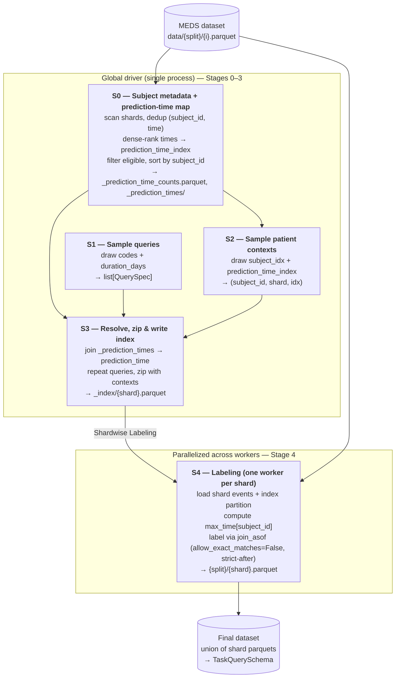

# Training task sampler redesign

## Pipeline overview

```
Stage 0  build _prediction_time_counts and _prediction_times (scan shards once, cache)
Stage 1  sample queries
Stage 2  sample (subject_idx, prediction_time_index)
Stage 3  resolve prediction_time and write per-shard index df
Stage 4  label each index shard independently
```

Stages 0–3 run in a single driver process; Stage 4 fans out one worker per shard.

## Pipeline



## Core invariants

These hold throughout the design; later sections reference them rather than restate them.

1. **One indexing space.** Prediction times are the **distinct `(subject_id, time)` rows**, sorted
    ascending by `(subject_id, time)` — in polars,
    `events.select(["subject_id", "time"]).unique().sort(["subject_id", "time"])`. Every distinct event
    time is a prediction time once the subject clears `min_prediction_times_per_subject`.
2. **`prediction_time_index` is a zero-based dense rank** of a timestamp within its subject's sorted
    distinct times. It equals the number of prediction times strictly before the chosen one.
    `n_prediction_times` is the subject's count of distinct times.
3. **Single source of truth.** The `(subject_id, prediction_time_index) → time` mapping is computed
    **once** in Stage 0 and persisted as `_prediction_times/{shard}.parquet`. Stage 3 resolves indices to
    timestamps by joining that map. **Stage 4 never performs index-space work** — no dedup, sort, rank,
    or index→timestamp resolution; it receives a real `prediction_time` and labels.
4. **Subjects may not span shards.** A subject lives in exactly one shard (Stage 4 derives
    `max_time[subject_id]` from a single shard). Stage 0 enforces this as a hard error.
5. **Determinism.** Distinct `(subject_id, time)` rows have no within-subject ties, so the dense rank is
    unique and a given `seed`/`prediction_time_index` always maps to the same `prediction_time`. All draws
    derive from `seed` with a fixed RNG consumption order (see *Determinism*).
6. **Labels use `(prediction_time, prediction_time + duration]`** — strict lower bound
    (`join_asof(..., allow_exact_matches=False)`), inclusive upper bound. This keeps labels
    leakage-safe against the loader (see Stage 4).
7. **Separate directory trees.** Final outputs (`training_tasks_dir`) and intermediate artifacts
    (`training_task_artifacts_dir`) live in disjoint, never-nested roots (see *Artifact layout*).
8. **Atomic writes guarantee restartability.** Stage 4 writes via temp file + `os.replace`, so a present
    `{shard}.parquet` is always complete and finished shards are skipped on rerun (see Stage 4).

> **Leakage safety with same-`time` events.** A timestamp can carry several events (different `code`s at
> the same `time`). The loader (`meds-torch-data`, backward `join_asof`, `time <= prediction_time`) pulls
> all of them as *model input*. Because the label window is strictly after `prediction_time` (invariant 6),
> a query-code occurrence at the cutoff timestamp is input, never a positive label.

## Inputs

| Input                              | Meaning                                                                                                                                                                                                |
| ---------------------------------- | ------------------------------------------------------------------------------------------------------------------------------------------------------------------------------------------------------ |
| `num_queries`                      | number of queries to sample                                                                                                                                                                            |
| `num_contexts_per_query`           | contexts drawn per query                                                                                                                                                                               |
| `min_prediction_times_per_subject` | minimum prior **prediction times** (distinct `(subject_id, time)` rows, not events) required before a prediction time is eligible. Default 50. Governs Stage 0 eligibility and the Stage 2 draw range. |
| `QueryDistribution`                | generative model of a query `(code, duration_days)`; owns both draws (see below)                                                                                                                       |
| `max_workers`                      | optional cap on Stage 4 worker count; caps `resolve_workers()` downward only                                                                                                                           |
| `split`                            | split to process                                                                                                                                                                                       |
| `seed`                             | top-level seed; all draws derive from it                                                                                                                                                               |

Path roots are **required Hydra args** (machine-specific, no `.env`/env-var fallback — see #235);
pass them as shell-expanded vars (`data_dir=$TOKENIZED_EVENTS_DIR out_dir=$TRAINING_TASKS_DIR`). See
`resolve_training_task_paths`:

| key / derived                    | meaning                                                                                 |
| -------------------------------- | --------------------------------------------------------------------------------------- |
| `data_dir` → `path_to_data`      | MEDS dataset root, with `path_to_data/data/{train,tuning,test}/{i}.parquet`. Required.  |
| `out_dir` → `training_tasks_dir` | final-output-only root (see *Artifact layout*). Required.                               |
| `training_task_artifacts_dir`    | intermediate-artifact root (see *Artifact layout*). No key: always the sibling default. |

**`QueryDistribution(query_codes, min_duration, max_duration, uniform|log-uniform)`** — owns both the
code draw and the duration draw, so Stage 1 is just `query_dist.sample(num_queries, rng) -> list[QuerySpec]`.

- `query_codes`: already-resolved `list[str]` code universe (one code per query). **Resolution stays
    outside the dataclass** — the caller runs `read_query_codes()` (a metadata root dir →
    `{dir}/metadata/codes.parquet`, e.g. `query_codes=$TENSORIZED_COHORT_DIR`; an explicit Hydra list; or a
    YAML/parquet path; see `read_query_codes` in `sample_tasks.py`) and passes the result in, e.g.
    `QueryDistribution.from_config(cfg, query_codes=read_query_codes(...))`. The dataclass does no file I/O.
- `min_duration`, `max_duration`: duration bounds in days.
- `uniform|log-uniform`: duration sampling distribution.
- `query_universe_size` is **derived** as `len(query_codes)` (no separate `num_codes` knob).

**`max_workers`** — Hydra key, default `null`. When `null`, the Stage 4 pool defaults to cores-on-node
(`resolve_workers()`); when set, caps that result downward only (`min(cores, max_workers)`). Set it when a
run OOMs (see *Orchestration & parallelism*). Supersedes the old `num_workers` knob.

**`training_tasks_dir`** — after a run it contains **nothing but** `{split}/{shard}.parquet`. The only
transient files are the same-dir atomic-write temps in Stage 4, present only mid-write.

**`training_task_artifacts_dir`** — not a config key and has no env var. Root for all intermediates:
Stage 0's `_prediction_time_counts.parquet` and `_prediction_times/`, and Stage 3's `_index/`. Always the
**sibling** of `training_tasks_dir` (`{parent}/{name}_artifacts`), so the two trees never nest by construction.

> `patient_universe_size` and per-subject `n_prediction_times` are computed-and-cached by Stage 0 from the
> split's shards, not supplied. `n_prediction_times` is a **column of `_prediction_time_counts`** and `subject_idx`
> is that table's **row position** (after the `subject_id`-sort), so Stage 2 gathers
> `n_prediction_times[subject_idx]` by row index, not a dict lookup.

## Outputs

- Shape `(num_queries * num_contexts_per_query) x 5`, written **partitioned by shard** as
    `training_tasks_dir/{split}/{shard}.parquet`; the final dataset is the union of the shard files.
- Columns: `["subject_id", "prediction_time", "code", "duration_days", "boolean_value"]`.
- `boolean_value` is nullable (`null` = censored); output is aligned to `TaskQuerySchema` via
    `TaskQuerySchema.align()` at the write boundary.

## Artifact layout

Two disjoint, never-nested roots (invariant 7):

```
training_tasks_dir/                         # final outputs ONLY
└── {split}/
    └── {shard}.parquet                     # Stage 4 output (the dataset)

training_task_artifacts_dir/                # all intermediates (default: sibling "<name>_artifacts")
└── {split}/
    ├── _prediction_time_counts.parquet     # Stage 0: subject_id, shard, n_prediction_times
    ├── _prediction_times/
    │   └── {shard}.parquet                  # Stage 0 map: subject_id, prediction_time_index, time
    └── _index/
        └── {shard}.parquet                  # Stage 3 partitioned index (carries prediction_time)
```

`training_tasks_dir/{split}/` holds only `{shard}.parquet` at rest, so it is directly consumable (glob
`*.parquet`) with no `_`-prefixed entries. Cleanup is a single `rm -rf training_task_artifacts_dir` that
cannot touch the dataset.

> **Stage 4 atomic-write temps are the one exception.** `os.replace` requires the temp to share a
> filesystem with its final path, so the temp lives in `training_tasks_dir/{split}/` (sibling of the
> target), not in the artifacts root (possibly a different mount). Temps are hidden
> (`.{shard}.parquet.tmp.{pid}`), exist only during a write, and are renamed away or swept on the next
> worker entry.

## Overview

Two phases, handed off via the on-disk partitioned index:

1. **Global driver (single process), Stages 0–3.** Samples queries and contexts across the split,
    resolves each context's `prediction_time` against the Stage 0 map, zips, and writes the partitioned
    index. Cheap: loads only `subject_id`/`time` columns, never full event payloads.
2. **Per-shard labeling workers (parallel), Stage 4.** Each worker reads one shard's index partition
    (which already carries the resolved `prediction_time`) plus its event payload, labels, and writes the
    final per-shard parquet — no indexing work (invariant 3).

Global sampling and index resolution run exactly once in the driver; labeling fans out without
re-sampling or re-resolving.

## Stages

### Stage 0 — Build (and cache) the prediction-time map + a derived subject-metadata summary

- **Input:** `path_to_data`, `split`, `min_prediction_times_per_subject`.
- **Outputs** (both cached under `training_task_artifacts_dir/{split}/`):
    - `_prediction_times/{shard}.parquet` — **the canonical Stage 0 artifact.** One row per eligible
        `(subject_id, distinct time)`: `["subject_id", "prediction_time_index", "time"]`. It holds the complete
        `(subject_id, prediction_time_index) → time` mapping and is the single source of truth for
        prediction-time indexing (invariant 3).
    - `_prediction_time_counts.parquet` — a **cached subject-level summary derived from `_prediction_times/`**, one row
        per eligible subject: `["subject_id", "shard", "n_prediction_times"]`. It carries no information not
        already in `_prediction_times/`; it exists only to make Stage 2 sampling inexpensive (so Stage 2 can
        gather per-subject `n_prediction_times` and `subject_idx` without scanning the full map).

> `_prediction_times/` is the canonical Stage 0 artifact and the single source of truth for
> prediction-time indexing. `_prediction_time_counts.parquet` is a cached subject-level summary derived from
> `_prediction_times/`; it exists only to make Stage 2 sampling inexpensive. The two are **not** independent
> sources of truth. By construction
>
> ```
> n_prediction_times(subject_id) = count of rows for that subject in _prediction_times/
> ```
>
> so any disagreement between `_prediction_time_counts.parquet` and `_prediction_times/` means `_prediction_time_counts.parquet`
> is **stale or corrupt** and must be rebuilt from `_prediction_times/`.

- **Eligibility:** `n_prediction_times > min_prediction_times_per_subject` (strictly more than the
    minimum). This guarantees at least one prediction time beyond the prefix, so Stage 2's draw range
    is non-empty.
- **Algorithm:**
    1. Loop over shards `path_to_data/data/{split}/{i}.parquet`, reading only `subject_id`, `time`. Per
        shard, dedup to distinct `(subject_id, time)`; record each `subject_id`'s `shard`.
    2. Concatenate across shards, then enforce invariant 4:
        `group_by("subject_id").n_unique("shard")` — any count `> 1` **raises**, listing the offending
        `subject_id`s and their shards. Hard error, no warning.
    3. Per subject, sort distinct timestamps ascending and assign a **contiguous zero-based index** →
        `prediction_time_index` (`pl.int_range(pl.len()).over("subject_id")` over the sorted distinct times).
        Because step 1 already deduped to distinct `(subject_id, time)` rows, there are no within-subject
        ties, so this positional index is identical to a dense rank — use `int_range`/row-number, not an
        actual `.rank("dense")` (cheaper, same result). What matters is the gapless `[0, n)` property that
        Stage 2's array-bounded `rng.integers` draw relies on (invariant 2). This is the canonical
        `_prediction_times/` map.
    4. **Derive `_prediction_time_counts` from `_prediction_times/`:** per subject, take its `shard` and
        `n_prediction_times` = the per-subject row count in `_prediction_times/`.
    5. Filter both tables to the eligibility condition above, then sort `_prediction_time_counts` by `subject_id`. The
        row position in this sorted table is `subject_idx`.
- `patient_universe_size` = number of rows in `_prediction_time_counts` (equivalently, eligible subjects in
    `_prediction_times/`).
- **Caching:** if both artifacts exist for this `(split, min_prediction_times_per_subject)`, reuse them;
    `_prediction_time_counts.parquet` is only valid as long as it agrees with `_prediction_times/` (see the row-count
    identity above).

### Stage 1 — Sample `num_queries` queries

- **Input:** `QueryDistribution` (resolved `query_codes` + duration params), `num_queries`, RNG seeded by
    `derive_seed(seed, "queries")`.
- **Output:** `list[QuerySpec(code: str, duration_days: float)]`.
- **Algorithm** (`query_dist.sample(num_queries, rng)` owns the whole draw):
    - Draw `num_queries` code indices uniformly over `[0, query_universe_size)`; map via `query_codes[idx]`.
    - Draw `num_queries` `duration_days` from the configured distribution over `[min_duration, max_duration]`.
        **`duration_days` is a float** — no rounding to whole days.
    - Zip into `QuerySpec`s.

### Stage 2 — Sample `N = num_queries * num_contexts_per_query` patient contexts

A patient context is a `(subject_idx, prediction_time_index)` pair; the timestamp is resolved in Stage 3.

- **Input:** `patient_universe_size`, the Stage 0 `_prediction_time_counts` table (row position = `subject_idx`),
    `N`, `min_prediction_times_per_subject`, RNG seeded by `derive_seed(seed, "contexts")`.
- **Algorithm** — one RNG stream, fixed consumption order (all `subject_idx`, then all
    `prediction_time_index`; invariant 5):
    - **Step A — subject indices.** `subject_idx = rng.integers(0, patient_universe_size, size=N)`, **with
        replacement** (`N` typically exceeds the eligible universe; iid-ness matters more than coverage,
        duplicate rows allowed). Map each to `subject_id`/`shard` via the Stage 0 table.
    - **Step B — prediction-time indices**, one vectorized array-bounded call:
        ```
        prediction_time_index = rng.integers(low  = min_prediction_times_per_subject,
                                             high = n_prediction_times[subject_idx])
        ```
        where `n_prediction_times[subject_idx]` is the length-`N` array gathered from the Stage 0 column at the
        drawn indices (`Generator.integers` accepts an array `high`, one draw per row in row order). This fixes
        RNG consumption to exactly one draw per row.
- **Draw range** `[min_prediction_times_per_subject, n_prediction_times)`:
    - `low = min_prediction_times_per_subject` enforces "at least that many prior prediction times" — since
        `prediction_time_index` is a zero-based rank (invariant 2), the smallest draw `50` selects the 51st
        distinct timestamp, with exactly 50 before it.
    - `high = n_prediction_times` is exclusive of the count, so the largest eligible draw is
        `n_prediction_times - 1` — the subject's **last** prediction time is eligible.
    - Stage 0's eligibility filter guarantees the range is non-empty.
- **Output:** length-`N` frame of `(subject_id, shard, prediction_time_index)`.

### Stage 3 — Resolve prediction times, zip, write partitioned index

- `np.repeat` the sampled queries `num_contexts_per_query` times and zip with the `N` contexts →
    `N` rows of `(subject_id, shard, prediction_time_index, code, duration_days)`.
- **Resolve `prediction_time`:** group contexts by `shard`; for each shard read its
    `_prediction_times/{shard}.parquet` and join on `(subject_id, prediction_time_index)`. Join **per
    shard** (not one global join) so the driver holds only one shard's payload-free map at a time, keeping
    memory flat. The join is total (same eligibility as Stage 2's bound); assert no nulls after as a guard.
- Partition by `shard`, write `training_task_artifacts_dir/{split}/_index/{shard}.parquet`.
- **Output columns:** `["subject_id", "prediction_time", "code", "duration_days"]` (shard is implied by
    the partition; `prediction_time_index` is resolved away and not carried forward).
- This index is the handoff artifact consumed by Stage 4.

### Stage 4 — Labeling (parallelized across workers)

- **Input** (per worker): the index partition `_index/{shard}.parquet` (already carries `prediction_time`)
    and the event payload `path_to_data/data/{split}/{shard}.parquet`.
- **Output:** `training_tasks_dir/{split}/{shard}.parquet`, columns
    `["subject_id", "prediction_time", "code", "duration_days", "boolean_value"]`, aligned to
    `TaskQuerySchema`.
- **Per-worker steps:**
    1. Load the index partition and shard events. No indexing work (invariant 3) — workers are
        timestamp-in, label-out.
    2. Compute `max_time[subject_id]` for the shard (one groupby) for the censoring check.
    3. Label each `(subject_id, prediction_time, code, duration_days)` row via the `join_asof` rule below.
    4. Align to `TaskQuerySchema` and write atomically (see below).
- **Parallelism:** group by shard, one fully-independent worker per shard (own index partition + payload,
    own output file) — embarrassingly parallel. See *Orchestration & parallelism*.
- After Stage 4, assert the union row count equals `num_queries * num_contexts_per_query`

#### Labeling rule

For each `(subject_id, prediction_time)` row, examine the window `(prediction_time, prediction_time + duration_days]`
(invariant 6: open lower bound via `join_asof(..., allow_exact_matches=False)`, closed upper bound). Resolve occurrence first;
censoring applies only when the event did **not** occur in the observed window:

| occurs in observed window | censored | `boolean_value` |
| ------------------------- | -------- | --------------- |
| yes                       | —        | True            |
| no                        | yes      | null            |
| no                        | no       | False           |

- **occurs** — an event with the query `code` falls strictly within the *observed* window
    `(prediction_time, min(prediction_time + duration_days, max_time[subject_id])]`. Label `True`, even if
    the window extends past the end of record.
- **censored** — not occurred **and** `prediction_time + duration_days > max_time[subject_id]` (the record
    ends before the window closes; the unobserved tail is unknown). Label `null`.
- **does not occur** — not occurred and the full window is observed
    (`prediction_time + duration_days <= max_time[subject_id]`). Label `False`.

**Float-duration implementation note.** `polars.duration(days=...)` expects integer day expressions, so a
float `duration_days` window must be added as e.g.
`prediction_time + pl.duration(seconds = duration_days * 86_400)` (or nanoseconds), not
`pl.duration(days=duration_days)`. Datetimes across the pipeline are kept at consistent
microsecond precision so `join_asof`'s `left_on`/`right_on` dtypes match.

> **Atomic writes & skip-on-success (restartability, invariant 8).** Stage 4 has no global cache, so a
> crashed run must resume without redoing finished shards or trusting half-written files:
>
> 1. **Atomic write.** Write to a sibling temp (`{out_dir}/.{shard}.parquet.tmp.{pid}`), then
>     `os.replace(tmp, final)`. `os.replace` is atomic on POSIX **within the same filesystem** (hence the
>     temp lives in `out_dir`, not `/tmp`), so the final file only ever exists complete; a killed worker
>     leaves only the temp. Stale temps are glob-and-unlinked on worker entry.
> 2. **Skip on success.** Before labeling, return immediately if a valid final output exists. Existence
>     alone suffices *because* writes are atomic (rule 1). Default check is "the final path exists"; an
>     optional stronger check re-opens the parquet footer to reject a zero-row/unreadable file. `--overwrite`
>     forces relabeling. The fan-out is thus idempotent: a rerun relabels only unfinished shards.

## Orchestration & parallelism

The whole pipeline runs from one console script, **`EQ_generate_training_tasks`** (the existing
`[project.scripts]` entry → `every_query.generate_tasks.sample_tasks:main`), in one process on one node.
Multi-node distribution is out of scope.

```bash
EQ_generate_training_tasks <hydra overrides>   # Stages 0–3 inline, then ProcessPoolExecutor over shards
```

Stages 0–3 run first (sequential code in `main`) and produce the partitioned index; the in-process Stage 4
fan-out starts only after Stage 3 has written it. Stages 0–3 are cheap and idempotent (Stage 0 caches both
artifacts), so reruns skip the rescan.

The driver fans labeling out with `concurrent.futures.ProcessPoolExecutor` (separate processes so the
CPU-bound polars labeling is not GIL-bound). Workers are passed **shard ids / paths, never DataFrames** —
each does its own parquet I/O and writes its own output atomically, so workers never contend. The driver
creates `out_dir` once before the pool starts.

```python
# index_dir = training_task_artifacts_dir/{split}/_index   (intermediate, Stage 3 output)
# out_dir   = training_tasks_dir/{split}                   (final, dataset)
def label_one_shard(shard, index_dir, data_dir, out_dir, overwrite=False):
    final = Path(out_dir) / f"{shard}.parquet"
    if not overwrite and final.exists():
        return shard, "skipped"  # atomic writes ⇒ a present file is a complete file

    idx = pl.read_parquet(f"{index_dir}/{shard}.parquet")  # already carries prediction_time
    events = pl.read_parquet(f"{data_dir}/{shard}.parquet")
    out = do_labeling(idx, events)  # no index resolution; just label

    tmp = final.with_name(f".{shard}.parquet.tmp.{os.getpid()}")  # same dir ⇒ same filesystem
    out.write_parquet(tmp)
    os.replace(tmp, final)  # atomic rename into place
    return shard, "labeled"  # tiny ack; big data never crosses the process boundary


with ProcessPoolExecutor(max_workers=resolve_workers()) as ex:
    futs = {ex.submit(label_one_shard, s, idx_dir, data_dir, out_dir): s for s in shards}
    for fut in as_completed(futs):
        fut.result()  # re-raise so a failed shard aborts the run loudly
```

### Polars threadpool

Each worker runs polars, which by default grabs all cores for its own threadpool. N workers each spawning a full pool gives N × cores threads and oversubscribes. The driver pins POLARS_MAX_THREADS=1 at the top of sample_tasks.py (before any polars import, so workers inherit it); with 200+ shards, process-level fan-out already saturates cores, so one polars thread per worker is correct and max_workers is sized by RAM, not cores. Keep the env line above all imports — a transitive import polars before it silently defeats the setting.

Worker count is resolved from the environment, then optionally capped:

```python
def resolve_workers(max_workers: int | None = None) -> int:
    # cores available on THIS node (SLURM) → all local cores (research server)
    for var in ("SLURM_CPUS_PER_TASK", "SLURM_CPUS_ON_NODE"):
        if var in os.environ:
            cores = int(os.environ[var])
            break
    else:
        cores = os.cpu_count()
    # `cores` is the ceiling; an explicit --max-workers may cap it lower (never higher).
    return min(cores, max_workers) if max_workers else cores
```

The pool is `ProcessPoolExecutor(max_workers=resolve_workers(cfg.max_workers))`.

SLURM submission is a **single node, single task** with many cpus — no array, no job dependency, no `srun`
fan-out (keep `srun` for the DDP training scripts, not here):

```bash
#SBATCH --partition=cpu        # labeling is CPU-only (no GPU)
#SBATCH --nodes=1
#SBATCH --ntasks=1
#SBATCH --cpus-per-task=32
EQ_generate_training_tasks <hydra overrides>   # whole pipeline; Stage 4 pool sized to 32
```

On a research server the same command runs; `resolve_workers()` falls back to `os.cpu_count()`.

## Determinism

- All draws derive from `seed` via `derive_seed`, splitting the **query axis** and **context axis** so
    they reproduce independently:
    - queries: `derive_seed(seed, "queries")`.
    - contexts: `derive_seed(seed, "contexts")` — a single RNG stream covering both `subject_idx` and
        `prediction_time_index`, consumed in fixed order (Step A then Step B). Reordering the draws,
        looping/grouping per subject, or splitting across sub-streams would change the output for a fixed seed.
- The Stage 0 `subject_id`-sorted ordering is the stable basis for `subject_idx → subject_id` and must be
    regenerated identically (sorted, deduped) each run. The dense-rank map is deterministic (invariant 5).
- Labeling is a pure function of the resolved index partition + shard events, so reruns produce identical
    labels.

## Open / out of scope

- This redesign targets the pre-training sampler (`sample_tasks.py`). Whether
    `sample_evaluation_tasks.py` adopts the same structure is out of scope, tracked separately.

## Design rationale / rejected alternatives

**Why index space resolved once in the driver.** Mapping an index to a timestamp is the only error-prone
step; running it exactly once, in one process (Stage 3), keeps Stage 4 workers trivial and removes any
two-place agreement to maintain (invariant 3).

**Why the eligibility `+1`.** A subject with exactly `min_prediction_times_per_subject` distinct times has
no eligible prediction time (the Stage 2 range `[min, n_prediction_times)` would be empty), so it is
dropped in Stage 0.

**Why `prediction_time_index` in Stage 2, not `prediction_time`.** The timestamp lives in the Stage 0
map; resolving in Stage 3 (still the driver) runs the join once over all `N` contexts before fan-out, so
parallel workers never resolve indices.

**Why vectorized array-bounded `rng.integers`.** A single call with an array `high` fixes RNG consumption
to one draw per row regardless of per-subject bounds. Looping/grouping per subject is rejected (group
order is not pinned); scaling floats to a per-row range is rejected (introduces rounding bias).

**Why the last prediction time is eligible (`high = n_prediction_times`, exclusive of count).** Matches
legacy "include the last prediction time" behavior. It diverges from the `max(time_index)` (last-excluded)
bound sketched in PR #201's flowchart; the last index tends to label censored/negative, still informative.

**Why a manual `--max-workers` cap, not a memory auto-clamp.** `resolve_workers()` sizes by core count,
but each worker holds a full shard's payload plus `join_asof` intermediates, so on a high-core/low-RAM node
memory binds first (OOM surfaces as an opaque `BrokenProcessPool`). Auto-deriving from
`SLURM_MEM_PER_NODE / est_shard_bytes` is rejected: peak memory is several× parquet size and varies per
shard, making the estimate a fragile fudge factor. The caller, who knows the requested `--mem`, sets an
explicit cap; default is unchanged (all cores).

**Why not `SLURM_NTASKS`/`srun` to size the pool.** `ProcessPoolExecutor` forks workers on the driver's
node only; `SLURM_NTASKS` counts tasks across the whole allocation. The correct knob is cores-on-this-node
(`SLURM_CPUS_PER_TASK`).

**Why not Hydra `-m` for the Stage 4 fan-out.** Hydra multirun is for hyperparameter sweeps: each task
re-enters `main` from the top, which would re-run global Stages 0–3 once per shard. Keep concerns
separated — Hydra for config, in-process `ProcessPoolExecutor` for parallelism, sbatch for allocation.

**Legacy divergences (intentional).**

- *Threshold unit.* Legacy `min_context_per_subject` thresholded a minimum number of *events* (`cum_count`
    over deduped `(subject_id, time, code)` rows); this design thresholds *prediction times* (distinct
    `(subject_id, time)` rows). The same numeric default (50) selects a different, stricter population — a
    subject with 50 events all on one day has a single prediction time.
- *Prediction-time space (parity preserved).* The distinct `(subject_id, time)` set sorted by
    `(subject_id, time)` matches what legacy `sample_contexts` used; only the eligibility threshold changed.
- *Float durations.* Stage 1 keeps `duration_days` as a float (legacy quantized to whole days), so a given
    `seed` will not reproduce legacy `duration_days` or labels. Accepted: only the prediction-time space is
    held to legacy parity, not the duration draw.

**Why pin POLARS_MAX_THREADS=1, not default threads.**
Process-level fan-out over 200+ shards already provides the parallelism; polars' intra-op threads on top only oversubscribe (num_workers × total_cores). The failure is silent (slower, never crashes), hence pinned rather than left default.\*\*
