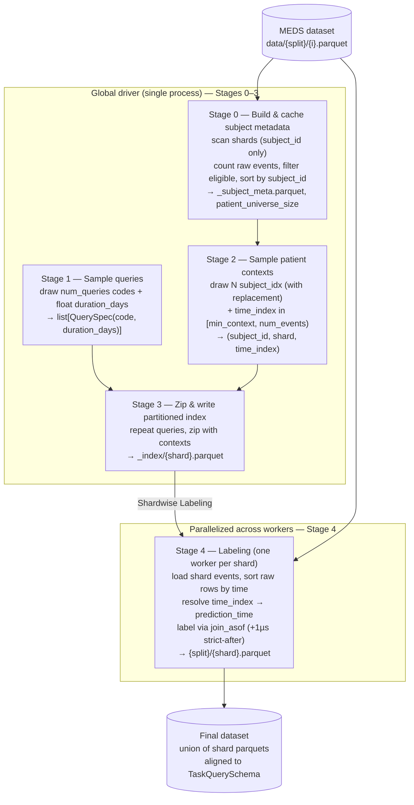

# Training task sampler redesign

## Pipeline



## Inputs
- `num_queries`
- `num_contexts_per_query`
- `min_context_per_subject` — minimum number of prior **raw events** a subject must have before an
  event row is eligible as a prediction time (default 50). Replaces the magic `50`. **Unit is raw
  event rows** (legacy `cum_count`-over-events parity) — see the indexing-space invariant below.
- `query_universe_size` — size of the code universe to sample query codes from (one code per query).
- `QueryDistribution(num_codes, min_duration, max_duration, uniform|log-uniform)`
  - `num_codes`: size of the code universe to draw from (a query is a **single** code).
  - `min_duration`, `max_duration`: bounds (in days) for the duration draw.
  - `uniform|log-uniform`: duration sampling distribution.
- `num_workers`
- `path_to_data` which points at a MEDS dataset s.t. `path_to_data/data/{train,tuning,test}/{i}.parquet`
- `split`
- `training_tasks_dir`
- `seed` — top-level seed; all random draws derive from it (see Determinism).

> `patient_universe_size` and `subject_id_to_num_events` are **computed-and-cached** by the
> pipeline (see Stage 0), not supplied by the caller. They are derived from the split's shards.

> **Indexing-space invariant (read before Stages 0/2/4).** There is exactly **one** indexing space
> for prediction times: a subject's **raw event rows, sorted ascending by `time` with a deterministic
> tiebreak** (stable sort preserving in-shard row order). Stage 0 counts these rows (`num_events`),
> Stage 2 draws `time_index` within that count, and Stage 4 resolves `time_index → prediction_time`
> against the very same sorted-raw-event sequence — `prediction_time` is the `time` of the
> `time_index`-th raw row, **not** an index into unique timestamps. The two spaces **must be
> identical**: counting raw events in Stage 0 while resolving by unique-by-time in Stage 4 would let a
> drawn `time_index` exceed the unique-time count (out of range) or denote a different amount of history
> than intended. This keeps parity with the legacy `cum_count`-over-events sampler.
>
> **Why this is leakage-safe even though timestamps repeat.** When the `time_index`-th raw row shares
> its timestamp with later raw rows, the loader (`time <= prediction_time`) pulls all of them in as
> *model input*, so the realized context is `>= time_index` rows. That is exactly the legacy behavior.
> No leakage results, because the label window is **strictly after** `prediction_time` (`+1µs` asof,
> see Stage 4): a query-code occurrence at the same timestamp as the cutoff is input, never a positive
> label. The deterministic tiebreak must match what the old runs used so a given `seed`/`time_index`
> reproduces the same `prediction_time`.

## Outputs
- Output shape: `(num_queries * num_contexts_per_query) x 5`, written **partitioned by shard** as
  `training_tasks_dir/{split}/{shard}.parquet`; the final dataset is the union of the shard files.
- Columns: `["subject_id", "prediction_time", "code", "duration_days", "boolean_value"]`
- `boolean_value` is nullable (`null` = censored); the output is aligned to `TaskQuerySchema`
  via `TaskQuerySchema.align()` at the write boundary.

# Overview

The pipeline has two phases:

1. **Global driver (single process)** — Stages 0–3. Samples queries and patient contexts across the
   whole split, zips them, and writes a **partitioned index** artifact. Cheap: never loads full
   event payloads into memory, only the `subject_id` / `time` columns it needs.
2. **Per-shard labeling workers (parallel)** — Stage 4. Each worker reads one shard's index
   partition plus its event payload, resolves prediction times, labels, and writes the final
   per-shard parquet.

The handoff between the two phases is the on-disk partitioned index (Stage 3 output), so the global
sampling runs exactly once and the labeling fans out without re-sampling.

## Stages

### Stage 0 — Build (and cache) subject metadata
- Input: `path_to_data`, `split`, `min_context_per_subject`
- Output (cached at e.g. `training_tasks_dir/{split}/_subject_meta.parquet`): one row per **eligible**
  subject with columns `["subject_id", "shard", "num_events"]`, where `num_events` is the count of
  **raw event rows** for that subject and **eligible** means `num_events >= min_context_per_subject`.
- Algorithm:
    - Loop over shards `path_to_data/data/{split}/{i}.parquet`, reading only `subject_id`. For each
      shard compute the per-subject raw row count (`len` per `subject_id`) and record which `shard`
      each `subject_id` belongs to (each subject lives in exactly one shard).
    - Concatenate across shards, filter to `num_events >= min_context_per_subject`.
    - Sort by `subject_id` to give a **stable, deterministic global ordering**. The row position in
      this sorted table is the `subject_idx` used by Stage 2.
- `patient_universe_size` = number of rows in this table (count of eligible subjects).
- Threshold unit is **raw event count** (matches the legacy `cum_count`-over-events semantics in
  `sample_contexts`), and is the same space Stage 4 indexes into — see the indexing-space invariant
  above.
- Caching: if the metadata file already exists for this `(split, min_context_per_subject)`, reuse it
  so reruns don't re-scan every shard.

### Stage 1 — Sample `num_queries` queries
- Input: `query_universe_size`, `num_queries`, `QueryDistribution`
- Output: `list[QuerySpec(code: str, duration_days: float)]`
- Algorithm:
    - Sample `num_queries` code indices uniformly over the code universe → query codes.
    - Sample `num_queries` `duration_days` from the configured distribution (`uniform` or
      `log-uniform`) over `[min_duration, max_duration]`. **`duration_days` is a float** (no rounding
      to whole days).
    - Zip into a list of `QuerySpec`.
- Note: reuses the draw logic from `sample_tasks()`, dropping the integer-rounding/clip step so the
  durations stay float.

### Stage 2 — Sample `(num_queries * num_contexts_per_query)` patient contexts
- A patient context is a `(subject_idx, time_index)` pair (the actual `prediction_time` is resolved
  later, in Stage 4 — see note).
- Input: `patient_universe_size`, `subject_id_to_num_events` (the Stage 0 metadata),
  `num_queries * num_contexts_per_query`, `min_context_per_subject`, `seed`
- Algorithm:
    - Draw `N = num_queries * num_contexts_per_query` subject indices:
      `subject_idx = rng.integers(0, patient_universe_size, size=N)` (**with replacement** — `N`
      typically exceeds the eligible universe, and iid-ness matters more than coverage; exact
      duplicate rows are allowed). Each `subject_idx` maps to a `subject_id` and its `shard` via the
      Stage 0 table.
    - For each drawn subject, draw a `time_index` in `[min_context_per_subject, num_events[subject])`.
      This indexes which **raw event row** (in time-sorted order) will serve as the prediction time
      (e.g. `time_index = 51` → the subject's 51st event row). Because Stage 0 already filtered to
      `num_events >= min_context_per_subject`, this range is always non-empty, and because the range is
      bounded by the same raw-event count Stage 4 resolves against, every drawn `time_index` is
      guaranteed in-range there.
- Output: a list/frame of length `N` with `(subject_id, shard, time_index)`.
- `time_index` is zero-based throughout this design

> **Why `time_index`, not `prediction_time`.** The actual timestamp requires that subject's sorted
> event times, which only get loaded when the owning shard is read. We therefore defer
> `time_index → prediction_time` resolution to the per-shard labeling worker (Stage 4), which loads
> the shard anyway. The global driver never materializes prediction timestamps.

### Stage 3 — Zip queries and contexts; write partitioned index
- `np.repeat` the sampled queries `num_contexts_per_query` times and zip with the `N` contexts,
  yielding `N` rows of `(subject_id, shard, time_index, code, duration_days)`.
- Partition by `shard` and write one index file per shard, e.g.
  `training_tasks_dir/{split}/_index/{shard}.parquet`.
- Output columns: `["subject_id", "shard", "time_index", "code", "duration_days"]`.
- This partitioned index is the handoff artifact consumed by Stage 4.

### Stage 4 — Labeling (parallelized across workers)
- Input (per worker): the index partition `training_tasks_dir/{split}/_index/{shard}.parquet` and the
  event payload `path_to_data/data/{split}/{shard}.parquet`.
- Output: `training_tasks_dir/{split}/{shard}.parquet` with columns
  `["subject_id", "prediction_time", "code", "duration_days", "boolean_value"]`, aligned to
  `TaskQuerySchema`.
- Per-worker steps:
    1. Load the shard events; per subject, **sort the raw event rows ascending by `time` with a
       deterministic, stable tiebreak** (preserve in-shard row order for equal timestamps — do **not**
       dedupe to unique timestamps), and resolve each `time_index` to its `prediction_time` (the `time`
       of the `time_index`-th raw row for that subject). This is the *same* raw-event ordering whose
       length Stage 0 counted as `num_events` (indexing-space invariant), so `time_index` is always in
       range. Optionally assert `time_index < num_events` per row as a guard. The tiebreak must match
       the legacy ordering so a given `seed`/`time_index` reproduces the same `prediction_time`.
    2. Compute `max_time[subject_id]` for the shard (one groupby) for the censoring check.
    3. Label each row via the single `join_asof` strategy below.
    4. Align to `TaskQuerySchema` and atomically write the shard output.
- Parallelism: group by shard, one worker per shard. The shard is the unit of parallelism and each
  shard is fully independent (reads its own index partition + event payload, writes its own output
  file), so labeling is embarrassingly parallel. See **Orchestration & parallelism** below for how
  this maps onto a research server vs. a SLURM cluster.

> **Float-duration implementation note.** `polars.duration(days=...)` expects integer day
> expressions, so a float `duration_days` window must be added as, e.g.,
> `prediction_time + pl.duration(seconds = duration_days * 86_400)` (or nanoseconds) rather than
> `pl.duration(days=duration_days)`. Keep microsecond datetime precision so the `+1µs` strict-after
> shift below still works.

For each `(subject_id, prediction_time)` row, look at the window `(prediction_time, prediction_time + duration_days]` for that subject.
> **Boundary alignment with the loader (no leakage, no lost event).** The occurs window is **strictly after** `prediction_time`, while `meds-torch-data` builds the model input from events **at or before** `prediction_time` (backward `join_asof`, `time <= prediction_time`). The two partition the timeline at the cutoff: the event exactly on `prediction_time` is *input*, and is never counted toward the label. So the model never sees a post-cutoff event that decides the label (no leakage), and the cutoff event is not dropped (it's input). Keeping the label's `+1µs` strict-after asof is what preserves this — relaxing it to `>=` would let an at-cutoff occurrence be both input *and* a positive label. **Occurrence is resolved first; censoring only applies when the event did *not* occur in the observed part of the window** — an event we actually saw fire is a positive even if follow-up is otherwise incomplete:

- **occurs** — an event with the query `code` falls strictly within the *observed* window `(prediction_time, min(prediction_time + duration_days, max_time[subject_id])]`. If so the label is `True`, regardless of whether the window extends past the end of the record.
- **censored** — the event did *not* occur in the observed window **and** `prediction_time + duration_days > max_time[subject_id]`, i.e. the record ends before the window closes, so we never observe whether the event would have fired in the unobserved tail.
- **does not occur** — the event did not occur and the full window is observed (`prediction_time + duration_days <= max_time[subject_id]`), so we are confident it is a true negative.

These collapse into a single nullable `boolean_value` (the `TaskQuerySchema` label): `True`/`False` from occurs takes precedence, and `null` only when not-occurred *and* censored.

| occurs (in observed window) | censored | boolean_value |
| --------------------------- | -------- | ------------- |
| yes                         | —        | True          |
| no                          | yes      | null          |
| no                          | no       | False         |

# Orchestration & parallelism

**The entire pipeline is kicked off by a single console script, `EQ_generate_training_tasks`** (the
existing `[project.scripts]` entry → `every_query.generate_tasks.sample_tasks:main`). It runs the whole
pipeline — Stages 0–3, then Stage 4 — **in one process on one node**. The pipeline is designed to run on
a single node (research server or a single-node SLURM job); multi-node distribution is intentionally out
of scope.

```bash
EQ_generate_training_tasks <hydra overrides>   # Stages 0–3 inline, then ProcessPoolExecutor over shards
```

Stages 0–3 run first and produce the partitioned index (Stage 3 output); Stage 4 then consumes it. This
ordering is just sequential code in `main` — the in-process Stage 4 fan-out does not start until Stage 3
has written the index. Stages 0–3 are cheap (only read `subject_id`/`time` columns) and idempotent
(Stage 0 caches `_subject_meta.parquet`), so reruns skip the rescan.

The single driver process fans the labeling out over shards with
`concurrent.futures.ProcessPoolExecutor` (separate processes, so the CPU-bound polars labeling is not
GIL-bound; a thread pool would serialize). Workers are passed **shard ids / paths**, never DataFrames —
each worker does its own parquet I/O and writes its own `{split}/{shard}.parquet` atomically, so workers
never contend (no shared output, no locks).

```python
def label_one_shard(shard, index_dir, data_dir, out_dir):
    idx    = pl.read_parquet(f"{index_dir}/{shard}.parquet")
    events = pl.read_parquet(f"{data_dir}/{shard}.parquet")
    do_labeling(idx, events).write_parquet(f"{out_dir}/{shard}.parquet")
    return shard  # tiny ack; big data never crosses the process boundary

with ProcessPoolExecutor(max_workers=resolve_workers()) as ex:
    futs = {ex.submit(label_one_shard, s, idx_dir, data_dir, out_dir): s for s in shards}
    for fut in as_completed(futs):
        fut.result()  # re-raise so a failed shard aborts the run loudly
```

Worker count is resolved from the environment so the same command works everywhere:

```python
def resolve_workers():
    # cores available on THIS node (SLURM) → all local cores (research server)
    for var in ("SLURM_CPUS_PER_TASK", "SLURM_CPUS_ON_NODE"):
        if var in os.environ:
            return int(os.environ[var])
    return os.cpu_count()
```

> **Do not use `SLURM_NTASKS`/`srun` to size this pool.** `ProcessPoolExecutor` forks workers on the
> driver's node only; `SLURM_NTASKS` counts tasks across the whole allocation. The correct knob is
> cores-on-this-node (`SLURM_CPUS_PER_TASK`).

SLURM submission is a **single node, single task** with many cpus — no array, no job dependency, no
`srun` fan-out (keep `srun` for the DDP training scripts, not here):

```bash
#SBATCH --partition=cpu        # labeling is CPU-only (no GPU)
#SBATCH --nodes=1
#SBATCH --ntasks=1
#SBATCH --cpus-per-task=32
EQ_generate_training_tasks <hydra overrides>   # whole pipeline; Stage 4 pool sized to 32
```

On a research server the exact same single command runs; `resolve_workers()` falls back to
`os.cpu_count()`.

> **Why not Hydra `-m` for the Stage 4 fan-out.** Hydra multirun is for hyperparameter sweeps: each task
> is an independent process that re-enters `main` from the top, which would re-run the global Stages 0–3
> once per shard. Keep concerns separated — Hydra for config, the in-process `ProcessPoolExecutor` for
> parallelism, sbatch for allocation.

# Determinism
- All random draws derive from the top-level `seed` via `derive_seed` (as in the current design),
  splitting the **query axis** and the **context axis** so they can be reproduced independently:
  - queries: `derive_seed(seed, "queries")`
  - contexts: `derive_seed(seed, "contexts")` (covers both the `subject_idx` and `time_index` draws)
- The Stage 0 `subject_id`-sorted ordering is the stable basis for `subject_idx → subject_id`; it
  must be regenerated identically (sorted, deduped) on every run so a given `seed` reproduces the
  same contexts.
- Labeling is a pure function of the index partition + shard events, so reruns produce identical
  labels.

# Open / out of scope
- This redesign targets the pre-training sampler (`sample_tasks.py`). Whether
  `sample_evaluation_tasks.py` adopts the same global-sampling structure is **out of scope** here and
  tracked separately.
