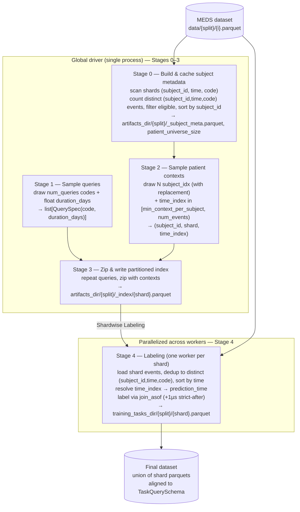

# Training task sampler redesign

## Pipeline



## Inputs
- `num_queries`
- `num_contexts_per_query`
- `min_context_per_subject` — minimum number of prior **distinct `(subject_id, time, code)` events** a
  subject must have before an event row is eligible as a prediction time (default 50). Replaces the
  magic `50`. **Unit is distinct `(subject_id, time, code)` event rows** — the same deduped basis the
  legacy `cum_count`-over-events sampler counted (legacy `_read_event_shard` dedups via `.unique()`
  before `cum_count`). See the indexing-space invariant below.
- `QueryDistribution(query_codes, min_duration, max_duration, uniform|log-uniform)` — the full
  generative model of a query `(code, duration_days)`. It owns **both** draws, so Stage 1 is just
  `query_dist.sample(num_queries, rng) -> list[QuerySpec]`.
  - `query_codes`: the code universe to sample query codes from (one code per query). Held as an
    already-resolved `list[str]`. **Resolution stays outside the dataclass:** the caller runs
    `read_query_codes()` (default `$PROCESSED/metadata/codes.parquet`, an explicit Hydra list, or a
    YAML/parquet path — see `read_query_codes` in `sample_tasks.py`) and passes the result in, e.g.
    `QueryDistribution.from_config(cfg, query_codes=read_query_codes(...))`. The dataclass holds the
    resolved codes; it does not do file I/O. Stage 1 draws integer indices into this list, so the code
    *strings* always come from `read_query_codes()`.
  - `min_duration`, `max_duration`: bounds (in days) for the duration draw.
  - `uniform|log-uniform`: duration sampling distribution.
  - `query_universe_size` is **derived** as `len(query_codes)`, not supplied separately. (No
    `num_codes` knob — the code universe and its size both come from `query_codes`.)
- `max_workers` — **optional** (Hydra config key, default `null`/`None`) explicit cap on the number of
  parallel Stage 4 labeling processes. When `null`, the pool defaults to cores-on-node
  (`resolve_workers()`); when set, it caps that result **downward only** (`min(cores, max_workers)`),
  never above the available cores. Set this when a run OOMs (see *Orchestration & parallelism*). This
  supersedes the older `num_workers` knob for Stage 4 sizing.
- `path_to_data` which points at a MEDS dataset s.t. `path_to_data/data/{train,tuning,test}/{i}.parquet`
- `split`
- `training_tasks_dir` — **final-output-only** root. After a run completes it contains **nothing but**
  the split dirs and their shard outputs: `training_tasks_dir/{split}/{shard}.parquet`. No metadata,
  no index, no scratch (the only transient files are the same-dir atomic-write temps in Stage 4, which
  exist only mid-write and are renamed away — see *Artifact layout* and Stage 4).
- `training_task_artifacts_dir` — **optional** (Hydra config key, default
  `null`/`None`). Root for all **intermediate** pipeline artifacts: the Stage 0 `_subject_meta.parquet`
  cache and the Stage 3 partitioned `_index/`. Keeping these out of `training_tasks_dir` is what lets
  that directory hold only `{split}/{shard}.parquet`. When `null` it defaults to a **sibling** of
  `training_tasks_dir` — `{training_tasks_dir.parent}/{training_tasks_dir.name}_artifacts` — so the two
  trees never nest (a nested `_artifacts` under `training_tasks_dir` would reintroduce the very
  non-split entries we are separating out). See *Artifact layout* below.
- `seed` — top-level seed; all random draws derive from it (see Determinism).

> `patient_universe_size` and the per-subject `num_events` are **computed-and-cached** by the
> pipeline (see Stage 0), not supplied by the caller. They are derived from the split's shards. There
> is no separate `subject_id`→`num_events` map: `num_events` is a **column of the Stage 0
> `_subject_meta` table**, and `subject_idx` is that table's **row position** (after the
> `subject_id`-sort), so Stage 2 gathers `num_events[subject_idx]` by row index, not by a dict lookup.

> **Indexing-space invariant (read before Stages 0/2/4).** There is exactly **one** indexing space
> for prediction times: a subject's **distinct `(subject_id, time, code)` event rows, sorted ascending
> by `(subject_id, time)`** (subject first so each subject's rows are contiguous and its `time_index`-th
> row is well-defined — a shard holds many subjects). "Distinct" means the same dedup the legacy
> sampler applied: legacy `_read_event_shard` does `.unique()` over `(subject_id, time, code)` before
> `sample_contexts` runs `cum_count`, so `num_events` counts **distinct** `(subject_id, time, code)`
> tuples, not raw on-disk rows. In polars this is
> `events.select(["subject_id", "time", "code"]).unique().sort(["subject_id", "time"])`. Stage 0 counts
> these distinct rows (`num_events`), Stage 2 draws `time_index` within that count, and Stage 4 resolves
> `time_index → prediction_time` against the very same deduped-and-sorted sequence — `prediction_time`
> is the `time` of the `time_index`-th distinct row, **not** an index into unique timestamps. The two
> spaces **must be identical**: counting distinct events in Stage 0 while resolving against raw or
> unique-by-time rows in Stage 4 would let a drawn `time_index` exceed the count (out of range) or
> denote a different amount of history than intended. The distinct-`(subject_id, time, code)` count is
> the same *basis* the legacy `cum_count`-over-deduped-events sampler used; the eligibility *boundary*
> (Stage 2's `low`) is defined for clean semantics and is not held to legacy parity (see Stage 2).
>
> **Determinism does not need a per-row tiebreak.** Both quantities that must be reproducible are
> robust to how equal-`time` rows are ordered. (1) The **count** `num_events` is the number of distinct
> `(subject_id, time, code)` tuples — order-independent by construction, so it is identical every run
> regardless of `.unique()`'s hash-order instability. (2) The resolved **`prediction_time`** is the
> `time` at position `time_index` in the by-`time` sort; rows that tie on `time` (distinct only in
> `code`) all carry the *same* timestamp, so the timestamp at any position is deterministic even though
> *which* tied row sits there is not. A given `seed`/`time_index` therefore maps to a stable
> `prediction_time`. (No explicit `_row_idx` / `maintain_order` tiebreak is required — and none would
> help, since `.unique()` has already discarded on-disk row order.)
>
> **Why this is leakage-safe even though timestamps repeat.** When the `time_index`-th distinct row
> shares its timestamp with later rows, the loader (`time <= prediction_time`) pulls all of them in as
> *model input*, so the realized context is `>= time_index` rows. That is exactly the legacy behavior.
> No leakage results, because the label window is **strictly after** `prediction_time` (`+1µs` asof,
> see Stage 4): a query-code occurrence at the same timestamp as the cutoff is input, never a positive
> label. And because the loader pulls in *all* rows at the resolved `time`, the choice of which
> equal-`time` row is "the" `time_index`-th one only shifts the realized context by tied rows that are
> loaded anyway — it never changes the label window.

## Outputs
- Output shape: `(num_queries * num_contexts_per_query) x 5`, written **partitioned by shard** as
  `training_tasks_dir/{split}/{shard}.parquet`; the final dataset is the union of the shard files.
- Columns: `["subject_id", "prediction_time", "code", "duration_days", "boolean_value"]`
- `boolean_value` is nullable (`null` = censored); the output is aligned to `TaskQuerySchema`
  via `TaskQuerySchema.align()` at the write boundary.

## Artifact layout

Two roots, with a hard split between **final outputs** and **intermediate artifacts**:

```
training_tasks_dir/                         # final outputs ONLY
└── {split}/
    └── {shard}.parquet                     # Stage 4 output (the dataset)

training_task_artifacts_dir/                # all intermediates (default: sibling "<name>_artifacts")
└── {split}/
    ├── _subject_meta.parquet               # Stage 0 cache
    └── _index/
        └── {shard}.parquet                 # Stage 3 partitioned index (Stage 4 input)
```

`training_tasks_dir/{split}/` therefore contains **only** `{shard}.parquet` files at rest — it is
directly consumable (glob `training_tasks_dir/{split}/*.parquet`) with no `_`-prefixed entries to
filter out. The two roots are kept **disjoint, never nested**, so cleaning up scratch is a single
`rm -rf training_task_artifacts_dir` that cannot touch the dataset.

> **Stage 4 atomic-write temps are the one exception, and they don't violate "final-only."** The
> `os.replace` atomicity used in Stage 4 requires the temp file to share a filesystem with its final
> path, so the temp **must** live in `training_tasks_dir/{split}/` (a sibling of the target), not in
> `training_task_artifacts_dir` (which may be a different mount). These temps are hidden
> (`.{shard}.parquet.tmp.{pid}`), exist only *during* a write, and are renamed away on success or
> swept on the next worker entry — so the directory holds only `{shard}.parquet` files between runs.

# Overview

The pipeline has two phases:

1. **Global driver (single process)** — Stages 0–3. Samples queries and patient contexts across the
   whole split, zips them, and writes a **partitioned index** artifact. Cheap: never loads full
   event payloads into memory, only the `subject_id` / `time` / `code` columns Stage 0 needs to dedup
   and count.
2. **Per-shard labeling workers (parallel)** — Stage 4. Each worker reads one shard's index
   partition plus its event payload, resolves prediction times, labels, and writes the final
   per-shard parquet.

The handoff between the two phases is the on-disk partitioned index (Stage 3 output), so the global
sampling runs exactly once and the labeling fans out without re-sampling.

## Stages

### Stage 0 — Build (and cache) subject metadata
- Input: `path_to_data`, `split`, `min_context_per_subject`
- Output (cached at `training_task_artifacts_dir/{split}/_subject_meta.parquet`): one row per **eligible**
  subject with columns `["subject_id", "shard", "num_events"]`, where `num_events` is the count of
  **distinct `(subject_id, time, code)` event rows** for that subject and **eligible** means
  `num_events >= min_context_per_subject + 1`. (The `+ 1`: a subject needs at least one event *beyond*
  the `min_context_per_subject`-event prefix for any prediction row to have the required prior context —
  see Stage 2's `time_index` range. A subject with exactly `min_context_per_subject` distinct events has
  no eligible prediction time and is dropped here.)
- Algorithm:
    - Loop over shards `path_to_data/data/{split}/{i}.parquet`, reading `subject_id`, `time`, `code`
      (all three are needed to dedup — counting raw rows would diverge from the legacy basis; see the
      indexing-space invariant). For each shard dedup to distinct `(subject_id, time, code)` tuples,
      compute the per-subject distinct-row count (`len` per `subject_id` after dedup), and record which
      `shard` each `subject_id` belongs to.
    - Concatenate across shards. **Fail fast on subjects split across shards:** a subject must live in
      exactly one shard, since Stage 4 resolves `time_index → prediction_time` and computes
      `max_time[subject_id]` from a *single* shard's events — a subject spanning shards would silently
      truncate both. After concatenating, check that each `subject_id` maps to exactly one `shard`
      (`group_by("subject_id").n_unique("shard")` — any count `> 1` is fatal) and **raise** listing the
      offending `subject_id`s and their shards. This is a hard error, not a warning: there is no safe
      default once a subject's events are partitioned.
    - Filter to `num_events >= min_context_per_subject + 1` (one event beyond the context prefix, so
      Stage 2's `[min_context_per_subject, num_events)` draw is non-empty).
    - Sort by `subject_id` to give a **stable, deterministic global ordering**. The row position in
      this sorted table is the `subject_idx` used by Stage 2.
- `patient_universe_size` = number of rows in this table (count of eligible subjects).
- Threshold unit is **distinct `(subject_id, time, code)` event count** — the same space Stage 4 indexes
  into (see the indexing-space invariant above), not raw on-disk row count.
- Caching: if the metadata file already exists for this `(split, min_context_per_subject)`, reuse it
  so reruns don't re-scan every shard.

### Stage 1 — Sample `num_queries` queries
- Input: `QueryDistribution` (carries the resolved `query_codes`, so
  `query_universe_size = len(query_dist.query_codes)`, plus the duration params), `num_queries`,
  `seed` (the query draws derive from `derive_seed(seed, "queries")` — see Determinism)
- Output: `list[QuerySpec(code: str, duration_days: float)]`
- Algorithm (`query_dist.sample(num_queries, rng)` owns the whole draw):
    - Sample `num_queries` code indices uniformly over `[0, query_universe_size)` and map each index
      back to its code string via `query_codes[idx]`.
    - Sample `num_queries` `duration_days` from the configured distribution (`uniform` or
      `log-uniform`) over `[min_duration, max_duration]`. **`duration_days` is a float** (no rounding
      to whole days).
    - Zip into a list of `QuerySpec`.
- Note: reuses the draw logic from `sample_tasks()`, dropping the integer-rounding/clip step so the
  durations stay float.

### Stage 2 — Sample `(num_queries * num_contexts_per_query)` patient contexts
- A patient context is a `(subject_idx, time_index)` pair (the actual `prediction_time` is resolved
  later, in Stage 4 — see note).
- Input: `patient_universe_size`, the Stage 0 `_subject_meta` table (columns
  `["subject_id", "shard", "num_events"]`, row position = `subject_idx`),
  `num_queries * num_contexts_per_query`, `min_context_per_subject`, `seed`
- Algorithm (a **single** `rng = default_rng(derive_seed(seed, "contexts"))` stream, consumed in a
  fixed order — all `subject_idx` first, then all `time_index` — so a given `seed` is reproducible):
    - **Step A — subject indices.** Draw `N = num_queries * num_contexts_per_query` subject indices:
      `subject_idx = rng.integers(0, patient_universe_size, size=N)` (**with replacement** — `N`
      typically exceeds the eligible universe, and iid-ness matters more than coverage; exact
      duplicate rows are allowed). Each `subject_idx` maps to a `subject_id` and its `shard` via the
      Stage 0 table.
    - **Step B — time indices (vectorized, array-bounded).** Draw all `N` `time_index` values in one
      vectorized call with a **per-row upper bound**:
      `time_index = rng.integers(low=min_context_per_subject, high=num_events[subject_idx])`, where
      `num_events[subject_idx]` is the length-`N` array obtained by gathering the Stage 0 `num_events`
      column at the drawn `subject_idx` (NumPy's `Generator.integers` accepts an array `high` and draws
      one integer per row, in row order). This fixes RNG consumption to exactly one draw per context
      row regardless of the per-subject bounds — do **not** loop per subject or group by subject (group
      iteration order is not pinned) and do **not** scale floats (introduces rounding bias). `time_index`
      is a **zero-based** index into the subject's distinct `(subject_id, time, code)` event rows (in
      `(subject_id, time)`-sorted order), so it equals the number of distinct events **strictly before**
      the prediction row. `low = min_context_per_subject` therefore enforces "at least
      `min_context_per_subject` prior distinct events": e.g. with the default `50`, the smallest draw
      `time_index = 50` selects the row at zero-based position 50 — the subject's **51st** distinct event,
      with exactly **50** distinct events before it as context. Stage 0's
      `num_events >= min_context_per_subject + 1` filter guarantees the half-open range
      `[min_context_per_subject, num_events)` is non-empty for every eligible subject (worst case
      `num_events == min_context_per_subject + 1` → the single candidate at position
      `min_context_per_subject`), and because the upper bound is the same distinct-event count Stage 4
      resolves against, every drawn `time_index` is guaranteed in-range there.
- Output: a list/frame of length `N` with `(subject_id, shard, time_index)`.
- `time_index` is zero-based throughout this design

> **Why `time_index`, not `prediction_time`.** The actual timestamp requires that subject's sorted
> event times, which only get loaded when the owning shard is read. We therefore defer
> `time_index → prediction_time` resolution to the per-shard labeling worker (Stage 4), which loads
> the shard anyway. The global driver never materializes prediction timestamps.

### Stage 3 — Zip queries and contexts; write partitioned index
- `np.repeat` the sampled queries `num_contexts_per_query` times and zip with the `N` contexts,
  yielding `N` rows of `(subject_id, shard, time_index, code, duration_days)`.
- Partition by `shard` and write one index file per shard at
  `training_task_artifacts_dir/{split}/_index/{shard}.parquet`.
- Output columns: `["subject_id", "shard", "time_index", "code", "duration_days"]`.
- This partitioned index is the handoff artifact consumed by Stage 4.

### Stage 4 — Labeling (parallelized across workers)
- Input (per worker): the index partition `training_task_artifacts_dir/{split}/_index/{shard}.parquet`
  and the event payload `path_to_data/data/{split}/{shard}.parquet`.
- Output: `training_tasks_dir/{split}/{shard}.parquet` with columns
  `["subject_id", "prediction_time", "code", "duration_days", "boolean_value"]`, aligned to
  `TaskQuerySchema`.
- Per-worker steps:
    1. Load the shard events and **dedup to distinct `(subject_id, time, code)` tuples, then sort
       ascending by `(subject_id, time)`** — exactly the legacy `_read_event_shard` basis
       (`events.select(["subject_id", "time", "code"]).unique().sort(["subject_id", "time"])`). Dedup on
       `(subject_id, time, code)` (matching Stage 0), **not** down to unique timestamps — deduping to
       unique `(subject_id, time)` would drop same-time / different-code rows and diverge from the
       distinct-row count Stage 0 took as `num_events`. No per-row tiebreak on equal-`time` rows is
       required: they share a timestamp, so the resolved `prediction_time` is the same whichever sits at
       `time_index` (see the indexing-space invariant). Resolve each `time_index` to its
       `prediction_time` (the `time` of the `time_index`-th distinct row for that subject). Because this
       is the *same* deduped-event sequence whose length Stage 0 counted (indexing-space invariant),
       `time_index` is always in range; assert `time_index < num_events` per row as a guard.
    2. Compute `max_time[subject_id]` for the shard (one groupby) for the censoring check.
    3. Label each row via the single `join_asof` strategy below.
    4. Align to `TaskQuerySchema` and **atomically** write the shard output (see *Atomic writes &
       skip-on-success* below): write to a temp file in the destination directory, then `os.replace`
       it into place so a reader never sees a partial file and a killed worker never leaves a
       truncated `{shard}.parquet`.
- Parallelism: group by shard, one worker per shard. The shard is the unit of parallelism and each
  shard is fully independent (reads its own index partition + event payload, writes its own output
  file), so labeling is embarrassingly parallel. See **Orchestration & parallelism** below for how
  this maps onto a research server vs. a SLURM cluster.

> **Atomic writes & skip-on-success (Stage 4 restartability).** Stage 4 has no global cache (unlike
> Stage 0), so a crashed or timed-out run must be *resumable* without redoing finished shards and
> without trusting half-written files. Two coupled rules:
>
> 1. **Atomic write.** A worker writes to a sibling temp path
>    (`{out_dir}/.{shard}.parquet.tmp.{pid}`) and then `os.replace(tmp, final)` onto the final path.
>    `os.replace` is atomic on POSIX **within the same filesystem** (hence the temp file lives in
>    `out_dir`, not `/tmp`), so the final `{shard}.parquet` only ever exists complete. A worker killed
>    mid-write leaves only the temp file, never a truncated final file. Temp files are best-effort
>    cleaned on worker entry (glob-and-unlink stale `.{shard}.parquet.tmp.*`) so retries don't leak.
> 2. **Skip on success.** Before labeling, a worker checks for an existing **valid** final output and
>    returns immediately if present. Existence alone is sufficient *only because* writes are atomic
>    (rule 1) — a present `{shard}.parquet` is guaranteed complete. The default validity check is "the
>    final path exists"; an optional stronger check re-opens the parquet footer
>    (`pl.scan_parquet(...).collect_schema()` / row-count) to reject a zero-row or unreadable file. A
>    `--overwrite` flag forces relabeling regardless. This makes the whole Stage 4 fan-out idempotent:
>    rerunning after a partial failure relabels only the shards that did not finish.

> **Float-duration implementation note.** `polars.duration(days=...)` expects integer day
> expressions, so a float `duration_days` window must be added as, e.g.,
> `prediction_time + pl.duration(seconds = duration_days * 86_400)` (or nanoseconds) rather than
> `pl.duration(days=duration_days)`. Keep microsecond datetime precision so the `+1µs` strict-after
> shift below still works.
>
> Float durations (no integer rounding/clip) are an **intentional divergence from legacy** — the old
> sampler quantized to whole days, so a given `seed` will not reproduce legacy `duration_days` or the
> resulting labels. This is accepted: only the *indexing space* (`time_index → prediction_time`) is
> held to legacy parity, not the duration draw.

For each `(subject_id, prediction_time)` row, look at the window `(prediction_time, prediction_time + duration_days]` for that subject — **open on the lower bound** (strict `>`, via the `+1µs` asof shift) and **closed on the upper bound** (inclusive `<=`).
> **Boundary alignment with the loader (no leakage, no lost event).** The occurs window is **strictly after** `prediction_time`, while `meds-torch-data` builds the model input from events **at or before** `prediction_time` (backward `join_asof`, `time <= prediction_time`). The two partition the timeline at the cutoff: the event exactly on `prediction_time` is *input*, and is never counted toward the label. So the model never sees a post-cutoff event that decides the label (no leakage), and the cutoff event is not dropped (it's input). Keeping the label's `+1µs` strict-after asof is what preserves this — relaxing it to `>=` would let an at-cutoff occurrence be both input *and* a positive label. **Occurrence is resolved first; censoring only applies when the event did *not* occur in the observed part of the window** — an event we actually saw fire is a positive even if follow-up is otherwise incomplete:

- **occurs** — an event with the query `code` falls strictly within the *observed* window `(prediction_time, min(prediction_time + duration_days, max_time[subject_id])]`. If so the label is `True`, regardless of whether the window extends past the end of the record.
- **censored** — the event did *not* occur in the observed window **and** `prediction_time + duration_days > max_time[subject_id]`, i.e. the record ends before the window closes, so we never observe whether the event would have fired in the unobserved tail.
- **does not occur** — the event did not occur and the full window is observed (`prediction_time + duration_days <= max_time[subject_id]`), so we are confident it is a true negative.

These collapse into a single nullable `boolean_value` (the `TaskQuerySchema` label): `True`/`False` from occurs takes precedence, and `null` only when not-occurred *and* censored.

| occurs (in observed window) | censored | boolean_value |
| --------------------------- | -------- | ------------- |
| yes                         | —        | True          |
| no                          | yes      | null          |
| no                          | no       | False         |

# Orchestration & parallelism

**The entire pipeline is kicked off by a single console script, `EQ_generate_training_tasks`** (the
existing `[project.scripts]` entry → `every_query.generate_tasks.sample_tasks:main`). It runs the whole
pipeline — Stages 0–3, then Stage 4 — **in one process on one node**. The pipeline is designed to run on
a single node (research server or a single-node SLURM job); multi-node distribution is intentionally out
of scope.

```bash
EQ_generate_training_tasks <hydra overrides>   # Stages 0–3 inline, then ProcessPoolExecutor over shards
```

Stages 0–3 run first and produce the partitioned index (Stage 3 output); Stage 4 then consumes it. This
ordering is just sequential code in `main` — the in-process Stage 4 fan-out does not start until Stage 3
has written the index. Stages 0–3 are cheap (only read `subject_id`/`time` columns) and idempotent
(Stage 0 caches `_subject_meta.parquet`), so reruns skip the rescan.

The single driver process fans the labeling out over shards with
`concurrent.futures.ProcessPoolExecutor` (separate processes, so the CPU-bound polars labeling is not
GIL-bound; a thread pool would serialize). Workers are passed **shard ids / paths**, never DataFrames —
each worker does its own parquet I/O and writes its own `{split}/{shard}.parquet` atomically, so workers
never contend (no shared output, no locks). The driver creates `out_dir` once **before** the pool
starts so workers never race on directory creation.

```python
# index_dir = training_task_artifacts_dir/{split}/_index   (intermediate, Stage 3 output)
# out_dir   = training_tasks_dir/{split}                   (final, dataset)
def label_one_shard(shard, index_dir, data_dir, out_dir, overwrite=False):
    final = Path(out_dir) / f"{shard}.parquet"
    if not overwrite and final.exists():
        return shard, "skipped"  # atomic writes ⇒ a present file is a complete file

    idx    = pl.read_parquet(f"{index_dir}/{shard}.parquet")
    events = pl.read_parquet(f"{data_dir}/{shard}.parquet")
    out    = do_labeling(idx, events)

    tmp = final.with_name(f".{shard}.parquet.tmp.{os.getpid()}")  # same dir ⇒ same filesystem
    out.write_parquet(tmp)
    os.replace(tmp, final)                                        # atomic rename into place
    return shard, "labeled"  # tiny ack; big data never crosses the process boundary

with ProcessPoolExecutor(max_workers=resolve_workers()) as ex:
    futs = {ex.submit(label_one_shard, s, idx_dir, data_dir, out_dir): s for s in shards}
    for fut in as_completed(futs):
        fut.result()  # re-raise so a failed shard aborts the run loudly
```

Because the write is atomic and the worker skips any shard whose final file already exists, rerunning
the command after a partial failure (crash, OOM, SLURM timeout) **relabels only the unfinished
shards** — finished shards are skipped, and no half-written file is ever mistaken for a finished one.
Pass `overwrite=True` to force a full relabel.

Worker count is resolved from the environment so the same command works everywhere, then capped by
an optional explicit override:

```python
def resolve_workers(max_workers: int | None = None) -> int:
    # cores available on THIS node (SLURM) → all local cores (research server)
    for var in ("SLURM_CPUS_PER_TASK", "SLURM_CPUS_ON_NODE"):
        if var in os.environ:
            cores = int(os.environ[var])
            break
    else:
        cores = os.cpu_count()
    # `cores` is the ceiling; an explicit --max-workers may cap it lower (never higher).
    return min(cores, max_workers) if max_workers else cores
```

The pool is then `ProcessPoolExecutor(max_workers=resolve_workers(cfg.max_workers))`.

> **Why a manual cap (and not a memory auto-clamp).** `resolve_workers()` sizes the pool by
> **core count**, but each Stage 4 worker holds a full shard's event payload resident in polars (plus
> `join_asof` intermediates), so on a high-core / low-RAM node the real binding constraint is memory,
> not CPU — too many workers OOM-kill and surface as an opaque `BrokenProcessPool`. We do **not**
> auto-derive the cap from `SLURM_MEM_PER_NODE / est_shard_bytes`: a shard's *peak* memory is several×
> its parquet size and varies per shard, so the estimate is a fragile fudge factor. Instead, the
> caller (who knows the `--mem` they requested) sets an explicit `--max-workers` Hydra override that
> caps the core-count result. Default behavior is unchanged (all cores); when a run OOMs you re-run
> with e.g. `max_workers=16`.

> **Do not use `SLURM_NTASKS`/`srun` to size this pool.** `ProcessPoolExecutor` forks workers on the
> driver's node only; `SLURM_NTASKS` counts tasks across the whole allocation. The correct knob is
> cores-on-this-node (`SLURM_CPUS_PER_TASK`).

SLURM submission is a **single node, single task** with many cpus — no array, no job dependency, no
`srun` fan-out (keep `srun` for the DDP training scripts, not here):

```bash
#SBATCH --partition=cpu        # labeling is CPU-only (no GPU)
#SBATCH --nodes=1
#SBATCH --ntasks=1
#SBATCH --cpus-per-task=32
EQ_generate_training_tasks <hydra overrides>   # whole pipeline; Stage 4 pool sized to 32
```

On a research server the exact same single command runs; `resolve_workers()` falls back to
`os.cpu_count()`.

> **Why not Hydra `-m` for the Stage 4 fan-out.** Hydra multirun is for hyperparameter sweeps: each task
> is an independent process that re-enters `main` from the top, which would re-run the global Stages 0–3
> once per shard. Keep concerns separated — Hydra for config, the in-process `ProcessPoolExecutor` for
> parallelism, sbatch for allocation.

# Determinism
- All random draws derive from the top-level `seed` via `derive_seed` (as in the current design),
  splitting the **query axis** and the **context axis** so they can be reproduced independently:
  - queries: `derive_seed(seed, "queries")`
  - contexts: `derive_seed(seed, "contexts")` — a **single** RNG stream covering both the `subject_idx`
    and `time_index` draws, consumed in a **fixed order**: all `subject_idx` first (Step A), then all
    `time_index` in one vectorized array-bounded call (Step B). This ordering is part of the
    determinism contract — reordering the two draws, looping/grouping per subject, or splitting them
    across sub-streams would change the output for a fixed `seed`.
- The Stage 0 `subject_id`-sorted ordering is the stable basis for `subject_idx → subject_id`; it
  must be regenerated identically (sorted, deduped) on every run so a given `seed` reproduces the
  same contexts.
- Labeling is a pure function of the index partition + shard events, so reruns produce identical
  labels.

# Open / out of scope
- This redesign targets the pre-training sampler (`sample_tasks.py`). Whether
  `sample_evaluation_tasks.py` adopts the same global-sampling structure is **out of scope** here and
  tracked separately.
