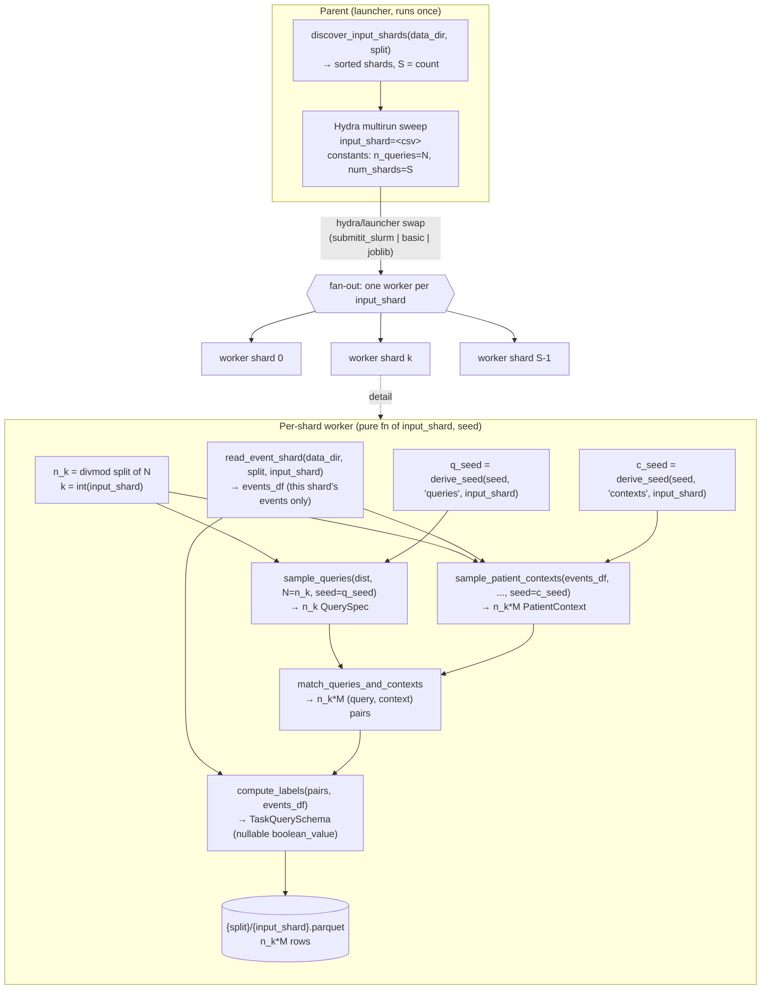

# EveryQuery Task Sampler Design Doc

## Pipeline Inputs and Outputs

Inputs:

- Query Distribution: `QueryDistribution` (codes drawn uniformly; only the duration draw is configurable)
- Context Distribution: `ContextDistribution` (eligibility + replacement policy)
- MEDS Dataset (D) — sharded on disk as `{data_dir}/data/{split}/{input_shard}.parquet`
- `split` — which MEDS split to sample from (`train` / `tuning` / `held_out`); selects the shard directory and is part of the output path
- Number of queries to sample (N)
- Number of patient context samples per sampled query (M)
- Global `seed` (int) — threaded through every stochastic stage via `derive_seed`
- `out_dir` + `overwrite` flag — output root and whether to recompute existing `{split}/{input_shard}.parquet` (resume support)

Output:

- `TaskQuerySchema` parquet of len (N\*M)

### Output Schema (`TaskQuerySchema`)

The single output contract lives in `every_query/data/schema.py` and is what `predict/`
and `evaluate/` consume — this pipeline must emit rows that pass `TaskQuerySchema.align()`
at the write boundary. It **extends MEDS `LabelSchema`**, so it inherits `subject_id` and
`prediction_time` plus the optional label columns, and adds the two query fields:

| Column            | Arrow type / polars dtype    | Required? | Meaning                                                             |
| ----------------- | ---------------------------- | --------- | ------------------------------------------------------------------- |
| `subject_id`      | inherited (`Int64`)          | yes       | subject the context belongs to                                      |
| `prediction_time` | inherited (`Datetime("us")`) | yes       | history cutoff; label window opens here                             |
| `query`           | `pa.large_string` / `Utf8`   | yes       | the MEDS **code** the query asks about                              |
| `duration_days`   | `pa.float32`                 | yes       | prediction-window horizon in days (continuous)                      |
| `boolean_value`   | `pa.bool_`, **nullable**     | optional  | collapsed label: `True`/`False` = occurs/not; **`null` = censored** |

Two naming/dtype gotchas the stages must honor:

- The label code column is named **`query`, not `code`**. The internal `QuerySpec.code`
    field maps onto the `query` column at the matching stage (`EveryQueryBatch.code` is a
    *different*, event-token tensor — do not rename `query`→`code`).
- `duration_days` is **`float32`**; emit Float32 directly so `TaskQuerySchema.align()`
    is a no-op cast.
- `boolean_value` is the *only* label column: the three-valued occurs/censored/negative
    outcome collapses into it, with `null` reserved for censored. There is no separate
    `censored` column in the on-disk schema (`empty_task_query_df()` shows the exact empty
    shape: `subject_id, prediction_time, query, duration_days, boolean_value`).

## Stages

1. Sample `N` Queries
2. Sample `N*M` patient contexts
3. Match up each query with a patient context
4. Compute Censor and Occurs label

## Pipeline Diagram



Across all `S` shards the per-shard budgets sum to `N`, so the union of outputs is **at most** `N*M` rows — exactly `N*M` when every shard has at least one eligible context, and fewer when some shard's eligible pool is empty (see [Empty-Pool Handling](#empty-pool-handling)).

> **What `dataset` is in the stage signatures.** The `dataset: MEDSDataset` parameter on `sample_patient_contexts` and `compute_labels` is the **single-shard events table** — the worker loads *only its own* shard via `read_event_shard(data_dir, split, input_shard)` (one `{split}/{input_shard}.parquet`, a polars frame of `(subject_id, time, code, ...)` rows), never the whole dataset. This is what keeps the worker a pure function of its `input_shard` and the pipeline embarrassingly parallel: contexts and labels for shard `k` depend only on shard `k`'s events. Both stages receive this same in-memory frame; it is read once per worker.

## Query Sampling Stage Details

### Function Signature

```python
def sample_queries(
    distribution: QueryDistribution,
    N: int,
    seed: int,                       # already stage-derived, e.g. derive_seed(global_seed, "queries", input_shard)
) -> list[QuerySpec]:
```

The stage takes a single pre-derived `seed` (a 31-bit int from
`every_query.utils.seeds.derive_seed`, ready for `np.random.default_rng(seed)`) rather than
the raw global seed, so the function stays a pure deterministic mapping `(distribution, N, seed) -> queries` and is agnostic to the sharding/stage-tag scheme. The worker is
responsible for the derivation: `derive_seed(global_seed, "queries", input_shard)` — the
`"queries"` stage tag keeps this draw decorrelated from the context draw even though both
use the same `(global_seed, input_shard)`.

### Datstructures

```python
@dataclass(frozen=True)
class QuerySpec:
    """A single pre-training query/task: one query code and one prediction-window duration (in days)."""

    code: str
    duration_days: float


@dataclass(frozen=True)
class QueryDistribution:
    """Defines a distribution that will provide samples of queries for EQ training. A sample is a single QuerySpec i.e. a (code, duration) tuple. The code is drawn **uniformly** over `codes` (no per-code weighting); only the duration draw is configurable."""

    codes: list[str]  # QuerySpec.code is drawn uniformly at random from this list
    min_duration_days: float = (
        1.0  # lower bound of the duration draw (default 1 day; must be > 0 so log-uniform is well-defined)
    )
    max_duration_days: float
    duration_days_distribution: (
        uniform | log - uniform
    )  # how QuerySpec.duration_days is drawn over [min_duration_days, max_duration_days]
```

### Reuse / implementation note

This stage is the existing `sample_tasks` primitive (`sample_tasks.py`), generalized in two
ways, with the rest carried over unchanged:

- **Durations become `float`.** `sample_tasks` currently quantizes to `int` and raises
    `TypeError` on float bounds; `QuerySpec.duration_days` is `float` (emitted as `float32`), so
    the duration draw drops the integer-rounding/clipping-to-int step.
- **Distribution kind becomes configurable.** `sample_tasks` hardcodes the log-uniform draw;
    here `QueryDistribution.duration_days_distribution` selects `uniform` vs. log-uniform.
- **Unchanged:** the uniform code-index draw (`rng.integers(0, len(codes), n)`), the
    single pre-derived-`seed` purity contract, and the `n == 0 → []` / validation edge cases.
    `TaskSpec` is renamed to `QuerySpec` (the rename is `code`→`query` only at the *matching*
    stage, not here).

## Patient Context Sampling Stage Details

### Function Signature

```python
def sample_patient_contexts(
    dataset: MEDSDataset,            # this shard's events table (read_event_shard), not the whole dataset
    distribution: ContextDistribution,
    N: int,
    M: int,
    seed: int,                       # already stage-derived, e.g. derive_seed(global_seed, "contexts", input_shard)
) -> pl.DataFrame:                   # columns (subject_id, prediction_time), len N*M (or 0 rows if the eligible pool is empty)
```

`N` is the number of sampled queries and `M` is the number of patient context samples per sampled query, so this stage draws `N*M` contexts in total (one flat list, ordered so the first `M` belong to query 0, the next `M` to query 1, and so on). Rather than re-running the sampler `N` times, all `N*M` contexts are drawn in a single seeded call and then sliced into per-query chunks of size `M` downstream (see Matching Stage) — under iid sampling this is equivalent to `M` independent draws per query but requires only one seed.

### Datastructures

`PatientContext` is the **conceptual** unit of a context draw; the stage materializes contexts
directly as a two-column `pl.DataFrame` (`subject_id`, `prediction_time`) rather than a list of
dataclasses, since the matching stage consumes a frame anyway (avoids a list→frame round-trip).

```python
@dataclass(frozen=True)
class PatientContext:
    """A single patient context: one subject and the prediction time that cuts off their observable history. Everything *at or before* `prediction_time` is model input; the label is evaluated over the window *strictly after* `prediction_time`. The inclusive cutoff matches `meds-torch-data`'s loader, which slices input with a backward `join_asof` (`time <= prediction_time`), so the event at the cutoff is fed to the model and the input/label boundary partitions the timeline cleanly with no overlap and no gap (see Compute Labels)."""

    subject_id: int
    prediction_time: datetime


@dataclass(frozen=True)
class ContextDistribution:
    """Defines a distribution that provides samples of patient contexts for EQ training. A sample from the distribution is a single PatientContext i.e. a (subject_id, prediction_time) tuple drawn from the eligible (subject, event-time) pairs in the dataset."""

    # a (subject, time) pair is eligible only once the subject has >= this many prior events
    min_context_events: int
    # True for PT, so N*M may exceed the number of eligible pairs
    with_replacement: bool
```

### Sampling Semantics

- **Candidate pool.** The candidate prediction times are every event time at which a subject has already accumulated at least `min_context_events` prior events.
- **Uniformity.** Each draw is uniform over the deduplicated set of eligible `(subject_id, prediction_time)` pairs. Sampling at the event-pair level (rather than first sampling a subject, then a time) means subjects with longer histories are proportionally more likely to be drawn — contexts are uniform over *eligible time points*, not over patients.
- **Replacement.** Sampling is with replacement so the caller can request `N*M` larger than the number of eligible pairs in a shard; for pre-training, iid-ness of contexts matters more than strict coverage of distinct time points.

### Determinism

The caller passes a pre-derived `seed` = `derive_seed(global_seed, "contexts", input_shard)`
(no task-shard axis in this design — queries and contexts are both drawn once per shard from
the same `global_seed`, split only by the stage tag `"queries"` vs `"contexts"` so the two
draws don't correlate). `derive_seed` is blake2b-based and therefore cross-process stable, so
Hydra multirun workers reproduce identical draws; the returned int is already masked into
NumPy's legal 31-bit range and feeds straight into `np.random.default_rng(seed)`. The seed
varies across the patient axis (`input_shard`) while remaining reproducible for a fixed
`(global_seed, input_shard)`. Because polars' `.unique()` is hash-ordered and order-unstable
across calls, the eligible-pair pool is explicitly sorted by `(subject_id, prediction_time)`
before sampling so that a position-based sampler is reproducible.

### Edge Cases

- `N*M == 0` or an empty eligible pool returns an empty list (zero-row frame), not an error.
- A subject whose entire record is shorter than `min_context_events` contributes no candidates.

> **Note (all-or-nothing fill).** Because sampling is with replacement, a non-empty pool *always* yields exactly `N*M` contexts — under-fill is never partial. A shard pool either has ≥1 eligible pair (→ exactly `N*M` rows) or is empty (→ 0 rows). The empty case is the only one the matching stage must special-case; see [Empty-Pool Handling](#empty-pool-handling).

### Reuse / implementation note

This stage is the existing `sample_contexts` primitive (`sample_tasks.py`) essentially
verbatim — the candidate-pool body carries over unchanged:

- eligibility via `cum_count().over("subject_id") >= min_context_events`,
- the explicit `.sort(["subject_id", "prediction_time"])` that makes the hash-ordered
    `.unique()` pool position-stable so a seeded `.sample` is reproducible,
- `with_replacement` sampling and the `n == 0` / empty-pool → 0-row-frame edge cases.

Only the surface changes: `min_context_per_subject` is named `min_context_events` (and
`with_replacement` is read off `ContextDistribution` instead of hardcoded), and the single
`n` argument is computed by the wrapper as `N*M` — which is exactly how the current worker
already calls it (`n=len(tasks) * contexts_per_task`).

## Match up Query and Patient Context Stage Details

### Function Signature

```python
def match_queries_and_contexts(
    queries: list[QuerySpec],     # len N
    contexts: pl.DataFrame        # (subject_id, prediction_time), len N*M (or 0 rows; see Empty-Pool Handling)
) --> pl.DataFrame  # len N*M, one row per (query, context) pair
```

Zip the `N` queries with the `N*M` contexts by assigning query `i` to its block of `M` consecutive contexts (`contexts[i*M : (i+1)*M]`). Implementation-wise this is a single columnar broadcast — `np.repeat` the per-query `query`/`duration_days` values across the block-ordered contexts frame — not a per-query loop. Each output row carries the query's `code` (written into the `TaskQuerySchema.query` column — note the rename) and `duration_days` (as `float32`) alongside the context's `subject_id` and `prediction_time` — i.e. the unlabeled `(query, context)` pairs that the next stage labels.

This stage and `compute_labels` are **deterministic** (no `seed` argument) — all randomness is confined to the two sampling stages, so reproducibility is fully pinned by the `(global_seed, input_shard)` that produced `queries` and `contexts`.

Under iid sampling this block assignment is equivalent to drawing `M` fresh contexts per query.

### Reuse / implementation note

This stage is the existing `build_index_df` primitive (`sample_tasks.py`) verbatim, renamed:

- the `np.repeat(np.arange(n_tasks), M)` block-broadcast, the `M = contexts.height // n_tasks`
    derivation, and the `code`→`query` rename + `float32` duration emission all carry over
    unchanged;
- the empty-pool / divisibility contract above is exactly `build_index_df`'s existing
    `contexts.height == 0 → empty schema frame` and `contexts.height % n_tasks != 0 → ValueError`.

Surface changes only: `TaskSpec`→`QuerySpec` (the `[t.code …]` / `[t.duration_days …]`
comprehensions are untouched — `QuerySpec` already carries both, and the `.astype(np.float32)`
on durations becomes a widening no-op instead of an int→float cast). `build_index_df` also
emits an intermediate `task_id` column that `compute_labels` ignores and drops; keep it for
debugging or strip it — it's not part of the output contract either way.

#### Empty-Pool Handling

The precondition is `len(contexts) == len(queries) * M` **or** `len(contexts) == 0`. The second
case is the empty-pool short-circuit: when a shard has no eligible contexts,
`sample_patient_contexts` returns a 0-row frame and this stage returns an empty
`TaskQuerySchema`-shaped frame (the worker then writes a 0-row parquet) rather than raising.
That shard's `n_k` queries are dropped — by design (Option A): the worker stays a pure,
resumable function of `(input_shard, seed)` and never coordinates with other shards to
re-fill the budget. An empty pool is logged as a warning so degenerate shards (e.g. every
subject shorter than `min_context_events`) surface rather than silently shrinking the output.

Any *other* mismatch (`len(contexts)` neither `0` nor `len(queries) * M`) is a hard error —
it can only mean a sampling bug, since with-replacement sampling makes fill all-or-nothing.

## Compute Censor and Occurs label Stage Details

### Function Signature

```python
def compute_labels(
    pairs: pl.DataFrame,    # output of the matching stage, len N*M
    dataset: MEDSDataset,   # this shard's events table (read_event_shard), not the whole dataset
) --> pl.DataFrame  # TaskQuerySchema, len N*M
```

For each `(query, context)` row, look at the window `(prediction_time, prediction_time + duration_days]` for that subject.

> **Boundary alignment with the loader (no leakage, no lost event).** The occurs window is **strictly after** `prediction_time`, while `meds-torch-data` builds the model input from events **at or before** `prediction_time` (backward `join_asof`, `time <= prediction_time`). The two partition the timeline at the cutoff: the event exactly on `prediction_time` is *input*, and is never counted toward the label. So the model never sees a post-cutoff event that decides the label (no leakage), and the cutoff event is not dropped (it's input). Keeping the label's `+1µs` strict-after asof is what preserves this — relaxing it to `>=` would let an at-cutoff occurrence be both input *and* a positive label. **Occurrence is resolved first; censoring only applies when the event did *not* occur in the observed part of the window** — an event we actually saw fire is a positive even if follow-up is otherwise incomplete:

- **occurs** — an event with the query `code` falls strictly within the *observed* window `(prediction_time, min(prediction_time + duration_days, max_time[subject_id])]`. If so the label is `True`, regardless of whether the window extends past the end of the record.
- **censored** — the event did *not* occur in the observed window **and** `prediction_time + duration_days > max_time[subject_id]`, i.e. the record ends before the window closes, so we never observe whether the event would have fired in the unobserved tail.
- **does not occur** — the event did not occur and the full window is observed (`prediction_time + duration_days <= max_time[subject_id]`), so we are confident it is a true negative.

These collapse into a single nullable `boolean_value` (the `TaskQuerySchema` label): `True`/`False` from occurs takes precedence, and `null` only when not-occurred *and* censored.

| occurs (in observed window) | censored | boolean_value |
| --------------------------- | -------- | ------------- |
| yes                         | —        | True          |
| no                          | yes      | null          |
| no                          | no       | False         |

`max_time` per subject is computed once per shard (one groupby) so the per-row censor check is an O(1) lookup. Occurrence is resolved for all rows in a single `join_asof(strategy="forward", by=["subject_id", "query"])` against the events table.

**Encoding the strict-after boundary in the asof key (don't filter after).** The window opens *strictly after* `prediction_time`, but a forward asof keyed directly on `prediction_time` returns the first event at-or-after it — and a naïve "then drop events == prediction_time" filter is **wrong**: forward asof yields only that *single* first match, so if it lands exactly on `prediction_time` (plausible — every `prediction_time` is itself one of the subject's event times) the filter discards it and **misses any later same-code event still inside the window**, producing a false negative. Instead, shift the left key: asof against `prediction_time + 1µs` (`_pt_shifted`) so the match is the first event whose time is `>= prediction_time + 1µs`, i.e. genuinely the first one strictly after the cutoff. The matched event then counts as occurring iff its time is `< prediction_time + duration_days` (the window's right edge). The `by=` key is `query` on both sides — the events frame's `code` column is renamed to `query` so the join aligns.

Because occurs is checked before censoring, a matched in-window event yields `True` even when `prediction_time + duration_days > max_time[subject_id]`; `null` is emitted only for rows with no in-window event whose window also extends past `max_time`. (Rows whose subject is absent from `max_time` — e.g. a pre-seeded index referencing another shard's subject — fall out of the left join with `max_time = null` and resolve to censored via `(window_end > max_time).fill_null(True)`.)

**Pinned output order.** Before writing, the labeled frame is sorted by the full key `(subject_id, prediction_time, query, duration_days)`. The `join_asof` internally sorts only by `(subject_id, query, _pt_shifted)`, which is *not* a total order over output rows — two distinct rows that share that key but differ in `duration_days` (e.g. query `A` at 30d and at 60d on the same context) could otherwise be permuted by polars' non-stable sort across runs. The final total-order sort makes row order a deterministic function of the row *set*, so reruns and different launchers produce byte-identical parquets. Fully-identical duplicate rows (see below) need no tie-break — any order of identical rows is byte-identical anyway.

**Duplicate rows are allowed and must not be deduplicated.** With-replacement context sampling and repeated `QuerySpec` draws mean the same `(query, subject_id, prediction_time, duration_days)` row can legitimately appear more than once; these repeats *are* the iid sample. Deduping would distort the sampling distribution, so no stage removes duplicates.

## Parallelization Across Input Shards

The per-shard worker is a **pure, idempotent function of `(input_shard, seed)`** that writes exactly one output parquet (`{split}/{input_shard}.parquet`). No worker reads or writes another worker's data, so the pipeline is embarrassingly parallel and parallelization lives entirely *above* `main()` — the sampling stages above need no changes.

Parallelization is two decoupled concerns:

1. **Discovery** — glob the shards that exist on disk:

    ```python
    def discover_input_shards(data_dir: Path, split: str) -> list[str]:
        """Basenames (sans .parquet) of every MEDS shard for `split`, sorted for determinism."""
        return sorted(p.stem for p in (data_dir / "data" / split).glob("*.parquet"))
    ```

    The sort fixes a stable shard ordering across invocations.

2. **Fan-out** — a thin wrapper turns discovery into a Hydra multirun sweep over a single axis, `input_shard=<csv>`. The sweep is **launcher-agnostic**: the *only* thing that varies between environments is the `hydra/launcher` override, so there is a single orchestration code path rather than separate SLURM vs. single-process implementations.

| Environment                 | Override                         | Behavior                                                              |
| --------------------------- | -------------------------------- | --------------------------------------------------------------------- |
| SLURM, many parallel jobs   | `hydra/launcher=submitit_slurm`  | one SLURM task per `input_shard`, fanned out                          |
| Single-process machine      | `hydra/launcher=basic`           | runs every shard sequentially in one process (Hydra multirun default) |
| Single machine, local cores | `hydra/launcher=joblib n_jobs=N` | local process pool (`n_jobs=1` for strictly one process)              |

**Invariant.** Correctness across all three launchers rests on the worker staying a pure function of `(input_shard, seed)`: for any *given* shard, the local loop and the SLURM fan-out write a byte-identical `{input_shard}.parquet` (different shards still produce different content — this is determinism across launchers/reruns for the same shard, not across shards) — which requires not just identical row *sets* but identical row *order*, guaranteed by the pinned final sort in the labeling stage (see [Pinned output order](#compute-censor-and-occurs-label-stage-details)). `overwrite=false` makes a killed run resumable (only missing `{input_shard}.parquet` files are recomputed; failed SLURM tasks rerun just their own shard) — note resume keys off file *existence*, so it is correct even where byte-identity is not.

### Distributing the Query Budget Across Shards

`N` (number of sampled queries) is a **global** budget, but contexts and queries shard differently:

- **Contexts are intrinsically sharded** — they are drawn from patients, and patients *are* the shard, so shard `k` can only ever produce contexts for the subjects it holds.
- **Queries are not** — a `QuerySpec` is a `(code, duration)` tuple from `QueryDistribution`, independent of which patients a shard holds. Each shard samples its *own* queries locally (seeded per-shard), so across `S` shards the global query set is `N` **distinct** iid draws, matched and labeled entirely within their own shard. (Evaluating the *same* query set against every shard's patients would be a different design — queries seeded independently of `input_shard` — and is explicitly not what this pipeline does.)

So "distributing N" means **partitioning the global query budget** so the per-shard counts sum to `N`:

```python
base, rem = divmod(N, S)  # S = len(discover_input_shards(...))
n_k = base + (1 if k < rem else 0)  # k = this shard's index in the sorted shard list
```

`base` queries to every shard, the `rem` remainder spread one-each over the first `rem` shards — exact, deterministic, sums to `N`. Shard `k` then emits `n_k * M` rows (or `0` if its eligible context pool is empty — see [Empty-Pool Handling](#empty-pool-handling)); summed over shards this is **at most** `N * M`, and exactly `N * M` when every shard has at least one eligible context.

**Why the worker computes `n_k` (not the launcher via the sweep).** Hydra multirun treats sweep axes as a **cross product**, not a zip, so `input_shard=a,b,c n_tasks=...` cannot hand each shard a different count. Instead the worker derives its own share from two inputs that need no per-cell zipping:

- `n_queries=N` and `num_shards=S` — **scalar constants, identical across all cells.** Discovery runs **once, in the parent** (which already globs to build the `input_shard` sweep); it passes `S` down as a constant override. The worker never touches the filesystem for this.
- `k` (this shard's index) — **already carried by the swept `input_shard`**, so it needs no separate override. With the standard dense-integer basenames (`0..S-1`) this is just `k = int(input_shard)`; for arbitrary basenames the parent passes the ordered shard list once and the worker does `k = shard_list.index(input_shard)`.

The worker then applies the `divmod` split and calls `sample_queries(distribution, N=n_k)`. `(S, k)` are deterministic functions of the inputs, so the worker stays a pure function of `(input_shard, seed)` plus the global config.

Config change: replace the per-worker `n_tasks` with a global `n_queries`; the parent injects `num_shards`.
